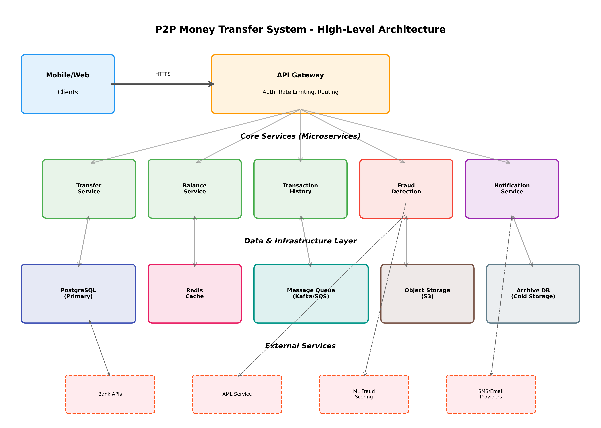
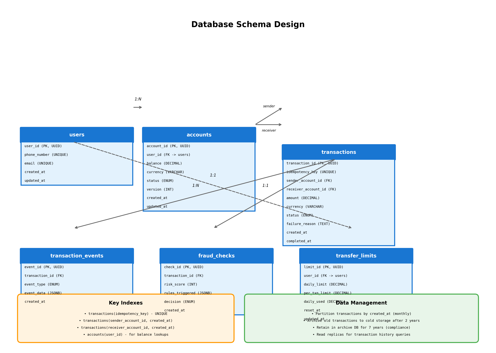
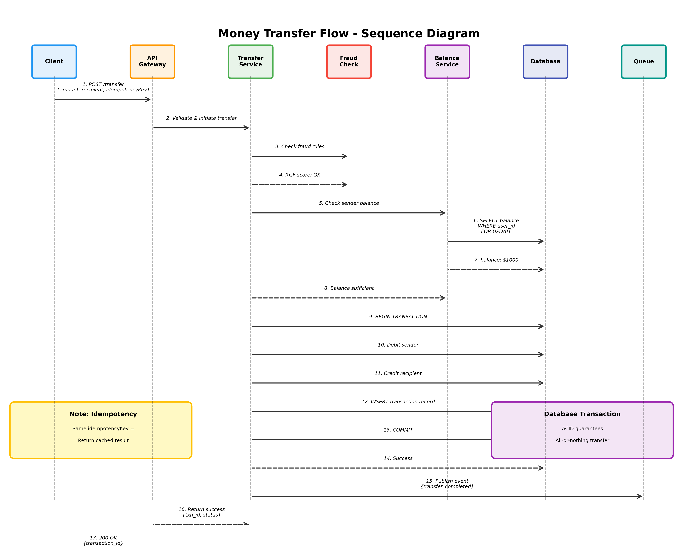

# システム設計面接課題

## 課題内容

> **「P2P送金システムを設計してください。」**

---

## Part 1: 確認すべき質問

### スコープと機能要件

```
- ZelleやVenmoのような、電話番号やメールアドレスで識別される
  リアルタイムの銀行間送金システムを設計するのでしょうか？
  Squareのようなカード決済ではなく？

- 送金、受取、残高確認、取引履歴のコア機能に焦点を当て、
  アカウント作成や投資機能は除外しますか？

- 単一通貨(USD)のみのサポートを想定し、
  多通貨対応や為替換算は含めませんか？

- 1回の送金は500ドル、1日あたり2,500ドルといった
  送金制限を設けますか？

- 受取人は電話番号またはメールアドレスで識別し、
  銀行口座番号を直接入力する必要はありませんか？

- 受取人が即座に資金を受け取れる即時決済を目指しますか？
  翌日ACH決済ではなく？
```

### 非機能要件とスケール

```
- 登録ユーザー約5,000万人、DAU 500万人の
  ユーザーベースを想定して設計しますか？

- 平均約200 TPS、バースト時は最大1,000 TPSを
  目標としますか？

- エンドツーエンドのレイテンシは3秒を目標としますか？

- 99.99%の可用性（年間約50分のダウンタイム）を
  目標としますか？

- 規制要件を満たすため、7年間の取引履歴を
  保持する必要がありますか？

- 初期リリースは米国のみを対象としますか？
```

### セキュリティとコンプライアンス

```
- ユーザーは登録時にKYC検証済みと想定し、
  認証サービスは本設計の範囲外としてよいですか？

- 基本的なルールベースの不正検出をインラインで実装し、
  MLベースのスコアリングは外部サービス呼び出しとして扱いますか？

- AMLスクリーニングは外部API呼び出しとして扱い、
  内部で設計する必要はありませんか？

- カードデータを扱わないため、PCI-DSSは範囲外とし、
  SOC2を主要なコンプライアンス目標としてよいですか？
```

### システムとインフラの前提条件

```
- クラウドプロバイダーとしてAWSを想定しますか？

- 認証とアカウント管理は既存の上流サービスとして扱い、
  送金レイヤーに焦点を当ててよいですか？

- バックエンド設計とAPIコントラクトに焦点を当て、
  フロントエンド/モバイルは範囲外としますか？

- マイクロサービスとモノリスの選択は、
  提案と正当化が可能ですか？
```

---

## Part 2: 面接官からの想定回答

### スコープと機能要件

```
Q: 送金、受取、残高、履歴のコア機能に限定しますか？
A: はい。アカウント作成と投資機能は範囲外です。

Q: 単一通貨(USD)のみですか？
A: はい、今のところ多通貨対応や為替換算はありません。

Q: 送金制限は1回500ドル、1日2,500ドルですか？
A: はい、その通りです。

Q: 受取人は電話番号またはメールで識別しますか？
A: はい、銀行口座番号を直接入力する必要はありません。

Q: ACH方式ではなく即時決済ですか？
A: はい、受取人は資金を即座に受け取れるべきです。
```

### 非機能要件とスケール

```
Q: 登録ユーザー約5,000万人、DAU 500万人ですか？
A: はい、それが設計すべき規模です。

Q: 平均200 TPS、ピーク1,000 TPSですか？
A: その通りです。

Q: エンドツーエンドのレイテンシ目標は3秒ですか？
A: はい、それが要件です。

Q: 可用性99.99%ですか？
A: その通りです（年間約50分のダウンタイム）。

Q: 取引履歴の保持期間は7年ですか？
A: はい、規制コンプライアンスのために必要です。

Q: 初期リリースは米国のみですか？
A: はい、グローバル展開は今のところ範囲外です。
```

### セキュリティとコンプライアンス

```
Q: KYCは上流で処理され、認証サービスは範囲外ですか？
A: その通りです。ユーザーは既に検証済みと想定してください。

Q: ルールベースの不正検出はインラインで、MLスコアリングは外部呼び出しですか？
A: はい、その分離で問題ありません。

Q: AMLスクリーニングは外部API呼び出しですか？
A: その通りです。内部で設計する必要はありません。

Q: PCI-DSSは範囲外で、SOC2が主要なコンプライアンス目標ですか？
A: はい、カードデータが関与しないためです。
```

### システムとインフラの前提条件

```
Q: クラウドプロバイダーはAWSですか？
A: はい、AWSを想定してください。

Q: 認証とアカウント管理は既存の上流サービスですか？
A: その通りです。送金レイヤーに焦点を当ててください。

Q: バックエンドとAPIコントラクトのみで、フロントエンドは範囲外ですか？
A: はい、バックエンドに焦点を当ててください。

Q: マイクロサービス vs モノリスは提案と正当化が可能ですか？
A: はい、選択を提案し正当化してください。
```

---

## Part 3: 面接官による深掘り質問

```
1. 送金処理中にサーバーがクラッシュした場合、どのように復旧しますか？

2. ネットワークリトライにより同じリクエストが2回到着した場合、
   二重送金をどのように防ぎますか？

3. 残高の読み取りと更新が同時に発生した場合、
   どのように一貫性を確保しますか？

4. 設計における単一障害点（SPOF）はどこにあり、
   どのように排除しますか？

5. 取引量が10倍に増加した場合、
   ボトルネックはどこにあり、どのようにスケールしますか？
```

---

## Part 4: 評価基準

```
✅ 要件収集
   オープンエンドな質問ではなく、具体的な前提を提案していますか？
   範囲を素早く絞り込み、トレードオフを確認できますか？

✅ コア設計決定
   冪等性、二重支払い防止、データ整合性に明確に対処できますか？

✅ トレードオフの明確化
   例：即時整合性 vs 可用性
       同期 vs 非同期の送金確認

✅ 段階的設計アプローチ
   シンプルに始め、弱点を特定し、反復的に改善する。

✅ 金融ドメインの知識
   冪等性キー、補償トランザクション、不変の監査ログ。
```

---

# システム設計ソリューション

## 目次
1. [エグゼクティブサマリー](#エグゼクティブサマリー)
2. [ハイレベルアーキテクチャ](#ハイレベルアーキテクチャ)
3. [コア設計決定](#コア設計決定)
4. [データベース設計](#データベース設計)
5. [API設計](#api設計)
6. [主要な取引フロー](#主要な取引フロー)
7. [スケーラビリティとパフォーマンス](#スケーラビリティとパフォーマンス)
8. [セキュリティとコンプライアンス](#セキュリティとコンプライアンス)
9. [障害処理と復旧](#障害処理と復旧)
10. [トレードオフと代替案](#トレードオフと代替案)

---

## エグゼクティブサマリー

### 設計哲学
このP2P送金システムは、金融取引にACID保証が必要であるため、結果整合性よりも**強整合性**と**正確性**を優先します。設計では**マイクロサービスアーキテクチャ**を採用し、PostgreSQLを主要なデータストアとして、データベーストランザクションを通じてデータの整合性を確保します。

### 主要指標
- **規模**: 登録ユーザー5,000万人、DAU 500万人
- **スループット**: 平均200 TPS、ピーク1,000 TPS
- **レイテンシ**: エンドツーエンドで3秒未満
- **可用性**: 99.99%（年間52分のダウンタイム）
- **データ保持**: コンプライアンスのため7年間

### コア原則
1. **冪等性**: すべての送金リクエストには冪等性キーが含まれ、二重支払いを防止
2. **原子性**: すべての残高更新はデータベーストランザクション内で実行
3. **監査可能性**: コンプライアンスのための不変の取引ログ
4. **スケーラビリティ**: リードレプリカとキャッシングによる水平スケーリング
5. **レジリエンス**: サーキットブレーカー、リトライ、補償トランザクション

---

## ハイレベルアーキテクチャ



### アーキテクチャレイヤー

#### 1. クライアントレイヤー
- モバイルアプリ（iOS/Android）
- Webアプリケーション
- すべての通信はTLS 1.3を使用したHTTPS経由

#### 2. APIゲートウェイ
- **認証**: JWTトークン検証
- **レート制限**: ユーザーごとおよびエンドポイントごとの制限
- **リクエストルーティング**: 適切なマイクロサービスへのルーティング
- **APIバージョニング**: 後方互換性のサポート
- **技術**: AWS API GatewayまたはKong

#### 3. コアサービス（マイクロサービス）

**送金サービス**
- 送金のオーケストレーション
- 冪等性チェックの実装
- 他のサービスとの調整
- transactionsテーブルへの主要なライター

**残高サービス**
- アカウント残高の管理
- 楽観的ロックの実装
- 並行残高読み取りの処理
- 頻繁にアクセスされる残高のキャッシング

**取引履歴サービス**
- 取引クエリの提供
- リードレプリカからの読み取り
- ページネーションの実装
- 古い取引のアーカイブ

**不正検出サービス**
- ルールベースの不正チェック（インライン）
- 外部MLスコアリングサービスの呼び出し
- ベロシティチェックの実装
- 疑わしい取引のブロック

**通知サービス**
- プッシュ通知の送信
- メール確認
- 大口送金のSMSアラート
- メッセージキューからのイベント消費

#### 4. データレイヤー

**PostgreSQL（プライマリ）**
- ACID準拠のリレーショナルデータベース
- ユーザー、アカウント、取引を保存
- 高可用性のためのマルチAZデプロイ
- 耐久性のための先行書き込みログ

**Redisキャッシュ**
- ユーザー残高のキャッシング
- 冪等性キーの保存（TTL: 24時間）
- レート制限カウンター
- セッションデータ

**メッセージキュー（Kafka/SQS）**
- 非同期イベント処理
- 取引完了イベント
- 通知配信
- 監査ログストリーミング

**オブジェクトストレージ（S3）**
- 長期アーカイブストレージ
- コンプライアンス文書
- 取引レシート
- 保存時の暗号化

**アーカイブデータベース**
- 2年以上前の取引のコールドストレージ
- 分析用のカラムナー形式
- コンプライアンスのための7年間保持

#### 5. 外部サービス
- **銀行API**: ACH/電信送金統合
- **AMLサービス**: マネーロンダリング対策チェック
- **ML不正スコアリング**: 高度な不正検出
- **SMS/メールプロバイダー**: Twilio、SendGrid

---

## コア設計決定

### 1. マイクロサービス vs モノリス

**選択**: マイクロサービス

**根拠**:
- **チームの自律性**: 送金、不正検出、通知を異なるチームが所有可能
- **独立したスケーリング**: 不正検出を送金から独立してスケール
- **技術の多様性**: 適切な場所で異なる技術スタックを使用
- **障害の分離**: 通知の失敗が送金をブロックしない

**トレードオフ**: モノリスデプロイのシンプルさよりも運用の複雑さが増加

### 2. 同期 vs 非同期処理

**選択**: ハイブリッドアプローチ

**同期**（クリティカルパス内）:
- 残高検証
- 不正ルールチェック
- データベーストランザクションのコミット

**非同期**（クリティカルパス外）:
- 通知
- ML不正スコアリング（取引後）
- 分析イベント
- 監査ログアーカイブ

**根拠**: クリティカルパスを高速（<3秒）に保ちながら、非クリティカルな作業をオフロード

### 3. データベース選択: PostgreSQL

**PostgreSQLを選択する理由**:
- **ACIDトランザクション**: 金融整合性に不可欠
- **行レベルロック**: 残高チェックのための`SELECT FOR UPDATE`
- **JSONBサポート**: 不正チェックデータの柔軟な保存
- **成熟したエコシステム**: 理解された運用とツール
- **リードレプリカ**: 読み取りの簡単な水平スケーリング

**検討した代替案**:
- **MySQL**: 同様の利点があるが、JSONBとより良い並行性のためにPostgreSQLを選択
- **NoSQL（DynamoDB）**: 複数行トランザクションがないため却下
- **NewSQL（CockroachDB）**: 初期規模には過剰設計

### 4. 冪等性戦略

**実装**:
```
1. クライアントがUUIDを冪等性キーとして生成
2. サーバーがRedisキャッシュで既存の結果を確認
3. 見つかった場合、キャッシュされたレスポンスを返す（304 Not Modified）
4. 見つからない場合、トランザクションを進める
5. 24時間のTTLで結果をキャッシュ
```

**データベース制約**:
```sql
CREATE UNIQUE INDEX idx_idempotency ON transactions(idempotency_key);
```

これにより、キャッシュが失敗してもデータベースレベルの冪等性が保証されます。

### 5. 整合性モデル

**選択**: 強整合性

**実装**:
- 単一のデータベーストランザクション内ですべての残高更新
- `SELECT FOR UPDATE`による悲観的ロック
- 送金に結果整合性なし

**トレードオフ**: より弱い整合性モデルよりもわずかに高いレイテンシ（3秒）

---

## データベース設計



### スキーマ詳細

#### usersテーブル
```sql
CREATE TABLE users (
  user_id UUID PRIMARY KEY DEFAULT gen_random_uuid(),
  phone_number VARCHAR(20) UNIQUE NOT NULL,
  email VARCHAR(255) UNIQUE NOT NULL,
  created_at TIMESTAMP DEFAULT NOW(),
  updated_at TIMESTAMP DEFAULT NOW()
);

CREATE INDEX idx_users_phone ON users(phone_number);
CREATE INDEX idx_users_email ON users(email);
```

#### accountsテーブル
```sql
CREATE TABLE accounts (
  account_id UUID PRIMARY KEY DEFAULT gen_random_uuid(),
  user_id UUID NOT NULL REFERENCES users(user_id),
  balance DECIMAL(19, 4) NOT NULL DEFAULT 0 CHECK (balance >= 0),
  currency VARCHAR(3) NOT NULL DEFAULT 'USD',
  status VARCHAR(20) NOT NULL DEFAULT 'active',
  version INTEGER NOT NULL DEFAULT 1, -- 楽観的ロック
  created_at TIMESTAMP DEFAULT NOW(),
  updated_at TIMESTAMP DEFAULT NOW()
);

CREATE INDEX idx_accounts_user ON accounts(user_id);
```

**DECIMAL(19,4)を使用する理由**:
- 合計19桁、小数点以下4桁
- セント精度で最大999兆ドルまでサポート
- 浮動小数点の丸め誤差を回避

#### transactionsテーブル
```sql
CREATE TABLE transactions (
  transaction_id UUID PRIMARY KEY DEFAULT gen_random_uuid(),
  idempotency_key UUID UNIQUE NOT NULL,
  sender_account_id UUID NOT NULL REFERENCES accounts(account_id),
  receiver_account_id UUID NOT NULL REFERENCES accounts(account_id),
  amount DECIMAL(19, 4) NOT NULL CHECK (amount > 0),
  currency VARCHAR(3) NOT NULL DEFAULT 'USD',
  status VARCHAR(20) NOT NULL, -- pending, completed, failed, reversed
  failure_reason TEXT,
  created_at TIMESTAMP DEFAULT NOW(),
  completed_at TIMESTAMP
) PARTITION BY RANGE (created_at);

CREATE UNIQUE INDEX idx_transactions_idempotency ON transactions(idempotency_key);
CREATE INDEX idx_transactions_sender ON transactions(sender_account_id, created_at DESC);
CREATE INDEX idx_transactions_receiver ON transactions(receiver_account_id, created_at DESC);
CREATE INDEX idx_transactions_status ON transactions(status, created_at);
```

**パーティショニング戦略**:
```sql
-- 月次パーティション
CREATE TABLE transactions_2024_01 PARTITION OF transactions
  FOR VALUES FROM ('2024-01-01') TO ('2024-02-01');

CREATE TABLE transactions_2024_02 PARTITION OF transactions
  FOR VALUES FROM ('2024-02-01') TO ('2024-03-01');
-- ... 各月ごとに継続
```

#### transaction_eventsテーブル（監査ログ）
```sql
CREATE TABLE transaction_events (
  event_id UUID PRIMARY KEY DEFAULT gen_random_uuid(),
  transaction_id UUID NOT NULL REFERENCES transactions(transaction_id),
  event_type VARCHAR(50) NOT NULL, -- initiated, fraud_checked, completed, failed
  event_data JSONB, -- イベントメタデータの柔軟な保存
  created_at TIMESTAMP DEFAULT NOW()
);

CREATE INDEX idx_events_transaction ON transaction_events(transaction_id, created_at);
CREATE INDEX idx_events_type ON transaction_events(event_type, created_at);
```

#### fraud_checksテーブル
```sql
CREATE TABLE fraud_checks (
  check_id UUID PRIMARY KEY DEFAULT gen_random_uuid(),
  transaction_id UUID NOT NULL REFERENCES transactions(transaction_id),
  risk_score INTEGER NOT NULL CHECK (risk_score BETWEEN 0 AND 100),
  rules_triggered JSONB, -- どのルールがマッチしたかを保存
  decision VARCHAR(20) NOT NULL, -- allow, block, review
  created_at TIMESTAMP DEFAULT NOW()
);

CREATE INDEX idx_fraud_transaction ON fraud_checks(transaction_id);
```

#### transfer_limitsテーブル
```sql
CREATE TABLE transfer_limits (
  limit_id UUID PRIMARY KEY DEFAULT gen_random_uuid(),
  user_id UUID NOT NULL REFERENCES users(user_id),
  daily_limit DECIMAL(19, 4) NOT NULL DEFAULT 2500.00,
  per_txn_limit DECIMAL(19, 4) NOT NULL DEFAULT 500.00,
  daily_used DECIMAL(19, 4) NOT NULL DEFAULT 0,
  reset_at TIMESTAMP NOT NULL, -- 毎日深夜にリセット
  updated_at TIMESTAMP DEFAULT NOW()
);

CREATE UNIQUE INDEX idx_limits_user ON transfer_limits(user_id);
```

### データアーカイブ戦略

**ホットデータ**（< 2年）:
- PostgreSQLプライマリデータベースに保存
- 高速クエリのためのインデックス付き
- 取引履歴サービス経由でアクセス可能

**コールドデータ**（2〜7年）:
- Parquet形式でAWS S3にアーカイブ
- 分析のためにRedshift/Athenaにロード
- 圧縮および暗号化
- コンプライアンス/法的要請のみで取得

---

## API設計

### REST APIエンドポイント

#### 1. 送金開始
```http
POST /v1/transfers
Authorization: Bearer <JWT_TOKEN>
Idempotency-Key: <UUID>

リクエストボディ:
{
  "recipient": {
    "phone_number": "+1234567890",  // またはメール
    "email": "recipient@example.com"
  },
  "amount": "100.00",
  "currency": "USD",
  "note": "ディナー割り勘"
}

レスポンス (201 Created):
{
  "transaction_id": "550e8400-e29b-41d4-a716-446655440000",
  "status": "completed",
  "amount": "100.00",
  "currency": "USD",
  "sender": {
    "user_id": "...",
    "phone_number": "+1987654321"
  },
  "recipient": {
    "user_id": "...",
    "phone_number": "+1234567890"
  },
  "created_at": "2024-05-25T10:30:00Z",
  "completed_at": "2024-05-25T10:30:02Z"
}

エラーレスポンス:
400 Bad Request - 無効な金額または受取人
402 Payment Required - 残高不足
409 Conflict - 異なるパラメータでの冪等性キーの重複
422 Unprocessable Entity - 送金制限超過
429 Too Many Requests - レート制限超過
503 Service Unavailable - 不正チェックタイムアウト
```

#### 2. 残高取得
```http
GET /v1/accounts/{account_id}/balance
Authorization: Bearer <JWT_TOKEN>

レスポンス (200 OK):
{
  "account_id": "...",
  "balance": "1250.75",
  "currency": "USD",
  "available_balance": "1250.75", // 保留中の取引を除く
  "pending_balance": "0.00",
  "updated_at": "2024-05-25T10:30:00Z"
}
```

#### 3. 取引履歴
```http
GET /v1/transactions?limit=50&cursor=<pagination_cursor>
Authorization: Bearer <JWT_TOKEN>

クエリパラメータ:
- limit: 結果の数（デフォルト: 50、最大: 100）
- cursor: ページネーションカーソル
- start_date: 開始日でフィルター（ISO 8601）
- end_date: 終了日でフィルター
- status: ステータスでフィルター（completed, pending, failed）

レスポンス (200 OK):
{
  "transactions": [
    {
      "transaction_id": "...",
      "type": "sent", // または "received"
      "counterparty": {
        "name": "John Doe",
        "phone_number": "+1234567890"
      },
      "amount": "100.00",
      "status": "completed",
      "created_at": "2024-05-25T10:30:00Z"
    },
    // ... さらなる取引
  ],
  "pagination": {
    "next_cursor": "eyJsYXN0X2lkIjoi...",
    "has_more": true
  }
}
```

#### 4. 取引詳細取得
```http
GET /v1/transactions/{transaction_id}
Authorization: Bearer <JWT_TOKEN>

レスポンス (200 OK):
{
  "transaction_id": "...",
  "idempotency_key": "...",
  "sender": {
    "user_id": "...",
    "phone_number": "+1987654321"
  },
  "recipient": {
    "user_id": "...",
    "phone_number": "+1234567890"
  },
  "amount": "100.00",
  "currency": "USD",
  "status": "completed",
  "note": "ディナー割り勘",
  "created_at": "2024-05-25T10:30:00Z",
  "completed_at": "2024-05-25T10:30:02Z",
  "events": [
    {
      "event_type": "initiated",
      "timestamp": "2024-05-25T10:30:00Z"
    },
    {
      "event_type": "fraud_checked",
      "timestamp": "2024-05-25T10:30:01Z"
    },
    {
      "event_type": "completed",
      "timestamp": "2024-05-25T10:30:02Z"
    }
  ]
}
```

### API設計原則

**1. 冪等性**:
- すべての書き込み操作は`Idempotency-Key`ヘッダーを受け入れる
- クライアントは各一意のリクエストに対してUUID v4を生成すべき
- 同じキーが異なるパラメータで使用された場合、サーバーは409を返す

**2. レート制限**:
```
ユーザーごと:
- 送金: 1分あたり10回
- 残高確認: 1分あたり50回
- 履歴リクエスト: 1分あたり100回

IPごと:
- すべてのエンドポイント合計で1分あたり100リクエスト
```

**3. バージョニング**:
- URIバージョニング: `/v1/transfers`
- 非推奨後6ヶ月間N-1バージョンをサポート

**4. エラー処理**:
- 一貫したエラーレスポンス形式
- トレーシングのためrequest_idを含める
- 実行可能なエラーメッセージを提供

**5. セキュリティ**:
- すべてのエンドポイントはJWT認証が必要
- 転送時の暗号化のためのTLS 1.3
- URLに機密データを含めない（POSTボディを使用）

---

## 主要な取引フロー



### 詳細な送金フロー

#### ステップバイステップ実行

**1. クライアントリクエスト**
```
POST /v1/transfers
Idempotency-Key: 550e8400-e29b-41d4-a716-446655440000
{
  "recipient": {"phone_number": "+1234567890"},
  "amount": "100.00"
}
```

**2. APIゲートウェイ検証**
- JWTトークンの検証
- レート制限のチェック
- 送金サービスへのルーティング

**3. 送金サービス - 冪等性チェック**
```python
# Redisキャッシュをチェック
cached_result = redis.get(f"idempotency:{idempotency_key}")
if cached_result:
    return cached_result  # 即座に返す

# データベースをチェック
existing_txn = db.query("SELECT * FROM transactions WHERE idempotency_key = ?",
                        idempotency_key)
if existing_txn:
    cache_and_return(existing_txn)
```

**4. 不正検出サービス - ルールベースチェック**
```python
fraud_rules = [
    check_velocity_limits(user_id),  # 最大10取引/時間
    check_amount_threshold(amount),   # $1000超でフラグ
    check_recipient_reputation(recipient_id),
    check_geolocation(user_ip),
]

risk_score = calculate_risk_score(fraud_rules)

if risk_score > 80:
    return "BLOCK"
elif risk_score > 50:
    return "REVIEW"  # 手動レビューキュー
else:
    return "ALLOW"
```

**5. 残高サービス - 十分な資金のチェック**
```sql
-- 競合状態を防ぐための悲観的ロック
SELECT balance
FROM accounts
WHERE account_id = :sender_account_id
FOR UPDATE;

-- 残高をチェック
IF balance < :amount THEN
    ROLLBACK;
    RETURN "INSUFFICIENT_FUNDS";
END IF;
```

**6. 送金サービス - トランザクション実行**
```sql
BEGIN TRANSACTION;

-- 送信者から引き落とし
UPDATE accounts
SET balance = balance - :amount,
    version = version + 1,
    updated_at = NOW()
WHERE account_id = :sender_account_id;

-- 受取人に入金
UPDATE accounts
SET balance = balance + :amount,
    version = version + 1,
    updated_at = NOW()
WHERE account_id = :receiver_account_id;

-- 取引レコードを挿入
INSERT INTO transactions (
    transaction_id,
    idempotency_key,
    sender_account_id,
    receiver_account_id,
    amount,
    currency,
    status,
    created_at,
    completed_at
) VALUES (
    :transaction_id,
    :idempotency_key,
    :sender_account_id,
    :receiver_account_id,
    :amount,
    'USD',
    'completed',
    NOW(),
    NOW()
);

-- 監査イベントを挿入
INSERT INTO transaction_events (
    transaction_id,
    event_type,
    event_data,
    created_at
) VALUES (
    :transaction_id,
    'completed',
    '{"ip": "192.168.1.1", "user_agent": "..."}',
    NOW()
);

COMMIT;
```

**7. メッセージキューへのイベント公開**
```json
{
  "event_type": "transfer_completed",
  "transaction_id": "550e8400-e29b-41d4-a716-446655440000",
  "sender_user_id": "...",
  "receiver_user_id": "...",
  "amount": "100.00",
  "timestamp": "2024-05-25T10:30:02Z"
}
```

**8. 通知サービス（非同期）**
```python
# キューからイベントを消費
event = kafka.consume("transfer_events")

# 通知を送信
send_push_notification(sender_user_id, "送金完了: $100")
send_push_notification(receiver_user_id, "入金: $100")
send_email(sender_email, "送金レシート", email_template)
```

**9. 結果のキャッシュ**
```python
# 24時間キャッシュ
redis.setex(
    f"idempotency:{idempotency_key}",
    86400,  # TTL: 24時間
    json.dumps(transaction_result)
)
```

**10. レスポンス返却**
```json
{
  "transaction_id": "550e8400-e29b-41d4-a716-446655440000",
  "status": "completed",
  "amount": "100.00",
  "completed_at": "2024-05-25T10:30:02Z"
}
```

### レイテンシ内訳

| ステップ | 目標レイテンシ | 備考 |
|------|---------------|-------|
| APIゲートウェイ | 10ms | トークン検証、ルーティング |
| 冪等性チェック（Redis） | 5ms | キャッシュヒット |
| 不正ルールチェック | 50ms | ルール評価 |
| 残高チェック（DB） | 20ms | SELECT FOR UPDATE |
| トランザクションコミット（DB） | 100ms | 複数行更新 |
| イベント公開（Kafka） | 10ms | Fire and forget |
| APIレスポンス | 5ms | JSONシリアライゼーション |
| **合計** | **~200ms** | 3秒目標を大幅に下回る |

---

## スケーラビリティとパフォーマンス

### キャパシティプランニング

#### 現在の規模（1年目）
- **ユーザー**: 登録5,000万人、DAU 500万人
- **取引**: 平均200 TPS、ピーク1,000 TPS
- **日次ボリューム**: 1日あたり1,730万取引
- **データ成長**: 月あたり約100GB

#### データベーススケーリング

**書き込み容量**:
```
PostgreSQL（プライマリ）:
- インスタンス: db.r6g.2xlarge（8 vCPU、64GB RAM）
- プロビジョンドIOPS: 20,000 IOPS
- 1,000 TPSを快適に処理
```

**読み取り容量**:
```
リードレプリカ（3台）:
- 読み取り集約型クエリをルーティング（取引履歴、残高確認）
- ディザスタリカバリのためのクロスリージョンレプリカ
- 強整合性のための100ms未満のラグ
```

**コネクションプーリング**:
```
PgBouncer:
- サービスごとのプールサイズ: 100接続
- 短命接続のためのトランザクションモード
- 接続オーバーヘッドの削減
```

#### キャッシング戦略

**Redisクラスター**:
```yaml
設定:
  ノード: 3（プライマリ + 2レプリカ）
  インスタンス: cache.r6g.large（2 vCPU、16GB RAM）
  エビクション: LRU（Least Recently Used）

キャッシュデータ:
  - ユーザー残高（TTL: 60秒）
  - 冪等性キー（TTL: 24時間）
  - レート制限カウンター（TTL: 1分）
  - 不正ルール設定（TTL: 5分）

目標ヒット率: > 95%
```

**キャッシュ無効化**:
```python
# 送金後に残高キャッシュを無効化
def on_transfer_complete(transaction):
    redis.delete(f"balance:{transaction.sender_account_id}")
    redis.delete(f"balance:{transaction.receiver_account_id}")
```

#### 水平スケーリング

**マイクロサービススケーリング**:
```yaml
送金サービス:
  最小レプリカ: 5
  最大レプリカ: 50
  CPU閾値: 70%
  メモリ閾値: 80%

残高サービス:
  最小レプリカ: 10  # 高い読み取りボリューム
  最大レプリカ: 100

取引履歴サービス:
  最小レプリカ: 5
  最大レプリカ: 30

不正検出サービス:
  最小レプリカ: 3
  最大レプリカ: 20

通知サービス:
  最小レプリカ: 3
  最大レプリカ: 20
```

**ロードバランシング**:
```
AWS Application Load Balancer:
- 10秒ごとのヘルスチェック
- 非正常閾値: 3回連続失敗
- 接続ドレイン: 終了前30秒
- スティッキーセッション: 不要（ステートレスサービス）
```

#### メッセージキュースケーリング

**Kafka設定**:
```yaml
トピック:
  transfer_events:
    パーティション: 10
    レプリケーション係数: 3
    保持期間: 7日

  notification_events:
    パーティション: 5
    レプリケーション係数: 3
    保持期間: 1日

コンシューマーグループ:
  - notification_service（3コンシューマー）
  - analytics_service（2コンシューマー）
  - audit_logger（1コンシューマー）
```

### パフォーマンス最適化

**1. データベースクエリ最適化**
```sql
-- 一般的なクエリのためのカバリングインデックス
CREATE INDEX idx_txn_history_covering
ON transactions(sender_account_id, created_at DESC)
INCLUDE (amount, receiver_account_id, status);

-- 日付範囲クエリのためのパーティションプルーニング
SELECT * FROM transactions
WHERE sender_account_id = :user_id
  AND created_at >= '2024-01-01'
  AND created_at < '2024-02-01';
-- transactions_2024_01パーティションのみをスキャン
```

**2. コネクションプーリング**
```python
# 接続オーバーヘッドを避けるためのコネクションプール使用
db_pool = create_pool(
    host="db.example.com",
    port=5432,
    min_size=10,
    max_size=100,
    timeout=5
)
```

**3. バッチ操作**
```python
# 通知の一括送信
def send_notifications_batch(events):
    notifications = [create_notification(e) for e in events]
    notification_service.send_batch(notifications)  # 単一のRPC呼び出し
```

**4. Read-After-Write整合性**
```python
# 送金後の残高確認では、プライマリから読み取り
if recently_transferred(user_id):
    balance = db_primary.query("SELECT balance FROM accounts WHERE ...")
else:
    balance = db_replica.query("SELECT balance FROM accounts WHERE ...")
```

### 監視と可観測性

**主要メトリクス**:
```
ビジネスメトリクス:
- 秒あたりの取引数（TPS）
- 成功率（目標: > 99.9%）
- 平均取引額
- 失敗した取引の理由

技術メトリクス:
- APIレイテンシ（p50、p95、p99）
- データベースクエリ時間
- キャッシュヒット率
- キューラグ
- サービスごとのエラー率

インフラメトリクス:
- CPU使用率
- メモリ使用量
- ネットワークスループット
- ディスクIOPS
```

**アラート**:
```yaml
アラート:
  - name: high_error_rate
    condition: error_rate > 1%
    duration: 5m
    severity: critical

  - name: high_latency
    condition: p95_latency > 5s
    duration: 2m
    severity: warning

  - name: low_cache_hit_rate
    condition: cache_hit_rate < 90%
    duration: 10m
    severity: warning

  - name: database_connection_pool_exhausted
    condition: available_connections < 10
    duration: 1m
    severity: critical
```

---

## セキュリティとコンプライアンス

### セキュリティ対策

#### 1. 認証と認可

**JWTトークン**:
```json
{
  "user_id": "550e8400-e29b-41d4-a716-446655440000",
  "account_id": "...",
  "iat": 1716630000,
  "exp": 1716633600,  // 1時間で期限切れ
  "scope": ["transfer:write", "balance:read"]
}
```

**トークン管理**:
- 短命なアクセストークン（1時間）
- 30日間の有効期限を持つリフレッシュトークン
- 更新ごとにトークンローテーション
- 侵害されたトークンの失効リスト

**認可チェック**:
```python
def authorize_transfer(user_id, sender_account_id):
    # ユーザーが送信者アカウントを所有していることを確認
    account = db.query("SELECT user_id FROM accounts WHERE account_id = ?",
                       sender_account_id)
    if account.user_id != user_id:
        raise UnauthorizedException("他のユーザーのアカウントから送金できません")
```

#### 2. データ暗号化

**転送時の暗号化**:
- すべてのAPI通信にTLS 1.3
- モバイルアプリの証明書ピンニング
- Perfect Forward Secrecy（PFS）有効化

**保存時の暗号化**:
```yaml
データベース:
  - KMSを使用したAWS RDS暗号化
  - 90日ごとの暗号化キーローテーション
  - Transparent Data Encryption（TDE）

S3アーカイブ:
  - サーバーサイド暗号化（SSE-KMS）
  - パブリックアクセスを制限するバケットポリシー
  - 監査証跡のためのバージョニング有効化

Redisキャッシュ:
  - ElastiCache保存時暗号化
  - ノード間の転送時暗号化
```

**機密データの取り扱い**:
```python
# PII（個人を特定できる情報）暗号化
def encrypt_pii(data):
    return aes_encrypt(data, key=get_pii_key())

# ルックアップ用にハッシュ化して電話番号を保存
phone_hash = sha256(phone_number + salt)
```

#### 3. 不正防止

**ルールベースチェック**（同期）:
```python
fraud_checks = {
    "velocity_check": lambda: user_txn_count_last_hour < 10,
    "amount_check": lambda: amount <= daily_limit,
    "recipient_check": lambda: not is_blocked_recipient(recipient_id),
    "geolocation_check": lambda: is_valid_country(user_ip),
    "device_fingerprint": lambda: is_known_device(device_id),
}
```

**MLベーススコアリング**（非同期）:
```python
# 取引完了後に学習のために呼び出される
def ml_fraud_scoring(transaction):
    features = extract_features(transaction)
    risk_score = ml_model.predict(features)

    if risk_score > 0.9:
        flag_for_review(transaction)
        potentially_reverse(transaction)
```

**不正検出の特徴量**:
- 取引金額
- 時刻
- 送信者/受取人の関係履歴
- デバイスフィンガープリント
- IPアドレスの地理位置情報
- 取引速度
- アカウント年齢

#### 4. セキュリティヘッダー

```http
Strict-Transport-Security: max-age=31536000; includeSubDomains
X-Content-Type-Options: nosniff
X-Frame-Options: DENY
Content-Security-Policy: default-src 'self'
X-XSS-Protection: 1; mode=block
```

#### 5. 監査ログ

**包括的なロギング**:
```python
audit_log = {
    "event_type": "transfer_initiated",
    "user_id": "...",
    "ip_address": "192.168.1.1",
    "user_agent": "Mozilla/5.0...",
    "request_id": "...",
    "timestamp": "2024-05-25T10:30:00Z",
    "details": {
        "amount": "100.00",
        "recipient_id": "...",
        "idempotency_key": "..."
    }
}
```

**不変の監査証跡**:
- すべてのイベントは追記専用ログに書き込まれる
- SIEM（セキュリティ情報・イベント管理）にストリーミング
- 保持期間: コンプライアンスのため7年
- ハッシュチェーンを使用した改ざん防止

### コンプライアンス要件

#### 1. SOC 2 Type II

**セキュリティコントロール**:
- 管理者アクセスの多要素認証
- 定期的なペネトレーションテスト（四半期ごと）
- インシデント対応計画
- セキュリティ意識向上トレーニング
- ベンダーセキュリティ評価

#### 2. データ保持

**取引レコード**:
- ホットストレージ: 2年（PostgreSQL）
- コールドストレージ: 5年（S3 + Redshift）
- 合計保持期間: 7年

**ユーザーデータ**:
- アクティブアカウント: 無期限保持
- 削除されたアカウント: 30日の猶予期間後、匿名化
- 削除権: GDPR準拠（該当する場合）

#### 3. AML（マネーロンダリング対策）

**取引監視**:
```python
aml_checks = {
    "large_transaction": amount > 10000,  # FinCENに報告
    "structured_transaction": detect_structuring(user_txns),
    "high_risk_jurisdiction": recipient_country in high_risk_list,
}

if any(aml_checks.values()):
    file_suspicious_activity_report(transaction)
```

**顧客確認（KYC）**:
- 登録時の本人確認（範囲外）
- 疑わしい活動の継続的監視
- 高リスク顧客の強化デューデリジェンス

#### 4. PSD2 / オープンバンキング（将来）

**強力な顧客認証（SCA）**:
- 30ユーロ超の送金には2要素認証
- 生体認証サポート
- 取引リスク分析の免除

---

## 障害処理と復旧

### 障害シナリオと解決策

#### 1. 取引処理中のサーバークラッシュ

**問題**: 送信者から引き落としした後、受取人に入金する前にサーバーがクラッシュする。

**解決策**: データベーストランザクションが原子性を保証
```sql
BEGIN TRANSACTION;
  UPDATE accounts SET balance = balance - 100 WHERE account_id = sender;
  UPDATE accounts SET balance = balance + 100 WHERE account_id = receiver;
  INSERT INTO transactions (...);
COMMIT;  -- すべて成功するか、すべてロールバック
```

サーバーがクラッシュした場合:
- トランザクションはPostgreSQLによってロールバックされる
- 部分的な状態はなし（両方の残高が変更されない）
- 先行書き込みログ（WAL）が耐久性を保証

**復旧**:
```python
# クライアントは同じ冪等性キーで再試行
POST /v1/transfers
Idempotency-Key: same-uuid-as-before

# サーバーはチェック: 取引が完了していない、通常通り処理
```

#### 2. 重複リクエスト（ネットワークリトライ）

**問題**: ネットワークタイムアウトがクライアントに再試行を引き起こし、二重送金のリスク。

**解決策**: 冪等性キーが重複処理を防ぐ

```python
# 最初のリクエスト
idempotency_key = "550e8400-..."
result = process_transfer(idempotency_key, amount, recipient)
cache_result(idempotency_key, result)

# 再試行リクエスト（同じキー）
cached = get_cached_result(idempotency_key)
if cached:
    return cached  # 前の結果を返す、二重送金なし
```

**データベース制約**:
```sql
-- ユニーク制約が重複挿入を防ぐ
CREATE UNIQUE INDEX idx_idempotency ON transactions(idempotency_key);
-- 同じキーが再度使用された場合、INSERTは失敗
```

#### 3. 並行残高更新

**問題**: 同じアカウントからの2つの送金が同時に実行される。

**解決策1**: 悲観的ロック（推奨）
```sql
BEGIN TRANSACTION;

-- 更新のために行をロック
SELECT balance FROM accounts
WHERE account_id = :sender_id
FOR UPDATE;

-- 他のトランザクションはここでロックが解放されるまで待機

IF balance >= :amount THEN
    UPDATE accounts SET balance = balance - :amount
    WHERE account_id = :sender_id;
    COMMIT;
ELSE
    ROLLBACK;
END IF;
```

**解決策2**: 楽観的ロック（代替）
```sql
-- バージョンカラムを追加
UPDATE accounts
SET balance = balance - :amount,
    version = version + 1
WHERE account_id = :sender_id
  AND version = :expected_version;

-- バージョン不一致（並行更新）の場合、UPDATEは0行に影響
-- アプリケーションは新しいバージョンで再試行
```

**トレードオフ**: 悲観的ロックはわずかに高いレイテンシだが、一貫性を保証する。

#### 4. データベース障害

**問題**: プライマリデータベースが利用不可になる。

**解決策**: 自動フェイルオーバー

```yaml
PostgreSQL高可用性:
  プライマリ: us-east-1a
  スタンバイ: us-east-1b、us-east-1c

  フェイルオーバー:
    検出時間: 30秒（ヘルスチェック）
    昇格時間: 60秒
    DNS更新: 30秒
    合計ダウンタイム: 約2分

  同期レプリケーション:
    - 少なくとも1つのスタンバイが書き込みを確認する必要がある
    - データ損失を防ぐ（RPO = 0）
```

**サーキットブレーカーパターン**:
```python
@circuit_breaker(failure_threshold=5, timeout=60)
def query_database(query):
    return db.execute(query)

# 5回連続失敗後:
# - サーキットが開く
# - データベースを試さずに高速失敗
# - 60秒後に再試行
```

#### 5. 外部サービス障害

**問題**: 不正検出サービスがダウンしている。

**解決策**: グレースフルデグラデーション

```python
def check_fraud(transaction):
    try:
        result = fraud_service.check(transaction, timeout=1s)
        return result
    except TimeoutError:
        # フォールバック: 基本チェックのみで取引を許可
        if transaction.amount < 500:
            log_warning("不正サービスタイムアウト、少額取引を許可")
            return "ALLOW"
        else:
            log_alert("不正サービスタイムアウト、高額取引をブロック")
            return "BLOCK"
    except Exception as e:
        log_error(f"不正サービスエラー: {e}")
        return "BLOCK"  # セキュリティのためフェイルクローズ
```

**指数バックオフでのリトライ**:
```python
@retry(max_attempts=3, backoff=exponential, exceptions=[NetworkError])
def call_external_service(request):
    return external_api.call(request)
```

#### 6. メッセージキュー障害

**問題**: Kafkaクラスターが利用不可で、通知を送信できない。

**解決策**: デッドレターキューを使用した非同期処理

```python
try:
    kafka.publish("transfer_events", event)
except KafkaException:
    # フォールバック: 後で処理するためにデータベースに保存
    db.execute("INSERT INTO pending_notifications (...)")

# バックグラウンドジョブが失敗した通知を再試行
def retry_pending_notifications():
    pending = db.query("SELECT * FROM pending_notifications WHERE retries < 3")
    for notification in pending:
        try:
            kafka.publish("transfer_events", notification)
            db.execute("DELETE FROM pending_notifications WHERE id = ?", notification.id)
        except:
            db.execute("UPDATE pending_notifications SET retries = retries + 1 WHERE id = ?",
                      notification.id)
```

### ディザスタリカバリ

**バックアップ戦略**:
```yaml
データベースバックアップ:
  フルバックアップ: 毎日午前2時（UTC）
  増分バックアップ: 6時間ごと
  ポイントインタイムリカバリ: 7日間
  保持期間: 30日

  クロスリージョンレプリケーション:
    プライマリ: us-east-1
    バックアップ: us-west-2
    レプリケーションラグ: 5分未満
```

**目標復旧時間（RTO）**: 1時間
**目標復旧時点（RPO）**: 5分

**ディザスタリカバリ計画**:
1. **検出**: 自動監視がオンコールエンジニアにアラート（5分）
2. **評価**: 障害の範囲を評価（10分）
3. **フェイルオーバー**: バックアップリージョンに切り替え（20分）
4. **検証**: クリティカルパスをテスト（15分）
5. **コミュニケーション**: ステークホルダーに通知（10分）

---

## トレードオフと代替案

### 主要な設計トレードオフ

#### 1. 強整合性 vs 可用性

**選択**: 強整合性（ACIDトランザクション）

**トレードオフ**:
- ✅ **利点**: 二重支払いなし、正しい残高を保証
- ✅ **利点**: システム状態についての推論がシンプル
- ❌ **欠点**: ネットワークパーティション中の可用性が低下（CAP定理）
- ❌ **欠点**: わずかに高いレイテンシ（結果整合性の約50msに対して約200ms）

**代替案**: 補償トランザクションによる結果整合性
```
利点: 高可用性、低レイテンシ
欠点: 複雑な競合解決、一時的な不整合の可能性
判定: 却下 - 金融の正確性が最重要
```

#### 2. マイクロサービス vs モノリス

**選択**: マイクロサービス

**トレードオフ**:
- ✅ **利点**: 独立したスケーリング（不正検出 vs 通知）
- ✅ **利点**: チームの自律性と速い機能開発速度
- ✅ **利点**: 障害分離（通知の失敗が送金をブロックしない）
- ❌ **欠点**: 運用の複雑さ増加（サービスメッシュ、分散トレーシング）
- ❌ **欠点**: サービス間のネットワークレイテンシ
- ❌ **欠点**: 分散トランザクションの複雑さ

**代替案**: モジュラーモノリス
```
利点: シンプルなデプロイ、低レイテンシ、容易なローカル開発
欠点: コンポーネントを独立してスケールするのが困難
判定: 初期段階では許容可能、マイクロサービスへの移行パスを計画
```

#### 3. 同期 vs 非同期通知

**選択**: 非同期（メッセージキュー経由）

**トレードオフ**:
- ✅ **利点**: 通知を待たずに送金が素早く完了（<200ms）
- ✅ **利点**: 失敗した通知のリトライロジック
- ✅ **利点**: 送金コードを変更せずに新しいコンシューマー（分析）を追加可能
- ❌ **欠点**: ユーザーが即座にプッシュ通知を受け取らない可能性
- ❌ **欠点**: メッセージキューのインフラが必要

**代替案**: 同期通知
```
利点: シンプルなアーキテクチャ、APIレスポンス前に通知を保証
欠点: 高レイテンシ（500ms以上）、通知失敗が送金をブロック
判定: 却下 - 通知は取引の正確性に不可欠ではない
```

#### 4. PostgreSQL vs NoSQL

**選択**: PostgreSQL

**トレードオフ**:
- ✅ **利点**: 正確性のためのACIDトランザクション
- ✅ **利点**: 豊富なクエリ機能（フィルタ付き取引履歴）
- ✅ **利点**: 成熟したツールと専門知識
- ❌ **欠点**: 垂直スケーリングの制限（ノードあたり約10K TPS）
- ❌ **欠点**: 必要な場合のシャーディングがより複雑

**代替案**: DynamoDB（NoSQL）
```
利点: 無制限の水平スケーリング、マネージドサービス
欠点: 複数アイテムトランザクションなし（引き落としと入金を原子的に実行不可）
欠点: 複雑なクエリパターンにはセカンダリインデックスが必要
判定: 却下 - トランザクションの欠如は金融にとって致命的
```

**代替案**: CockroachDB（NewSQL）
```
利点: ACID + 水平スケーリング、設計上分散
欠点: 高い運用の複雑さ、成熟度の低いエコシステム
判定: PostgreSQLの規模を超えた将来（>10K TPS）に検討
```

#### 5. 悲観的 vs 楽観的ロック

**選択**: 悲観的ロック（`SELECT FOR UPDATE`）

**トレードオフ**:
- ✅ **利点**: リトライロジックなしで競合状態を防ぐ
- ✅ **利点**: シンプルなアプリケーションコード
- ❌ **欠点**: データベースロックを長時間保持
- ❌ **欠点**: 注意しないとデッドロックの可能性

**代替案**: 楽観的ロック（versionフィールド）
```
利点: より良い並行性、ロック競合なし
欠点: リトライロジックが必要、競合時の無駄な作業
判定: 許容可能な代替案、読み取り集約型ワークロード（残高確認）に使用
```

### 将来の拡張

#### 1. 多通貨サポート

**必要な変更**:
- すべての金額カラムに`currency`フィールドを追加
- 外国為替サービス統合の実装
- 為替レートと手数料の処理
- 監査のための為替レート履歴の保存

**推定工数**: 2〜3ヶ月

#### 2. 定期送金

**必要な変更**:
- スケジュールを持つ新しい`recurring_transfers`テーブル
- スケジュールされた送金を実行するバックグラウンドジョブ
- キャンセルと変更のAPI
- 保留中の定期送金の残高保留

**推定工数**: 1ヶ月

#### 3. マルチパーティ送金（割り勘）

**必要な変更**:
- 複数の受取人をサポートするようにトランザクションモデルを拡張
- 分割金額の計算（均等/カスタム）
- 部分的な失敗の処理（一部の受取人が利用不可）
- 分割リクエストを管理するためのUI

**推定工数**: 2ヶ月

#### 4. 送金の取り消し/返金

**必要な変更**:
- transactionsテーブルに`reversed_transaction_id`を追加
- 認可チェック付きの取り消しAPIの実装
- 部分的に取り消されたトランザクションの処理
- すべての取り消しの監査証跡

**推定工数**: 3週間

#### 5. ブロックチェーン監査証跡

**コンセプト**: ブロックチェーンベースの不変の監査ログ

**利点**:
- 取引整合性の暗号的証明
- コンプライアンスのための否認防止
- 規制当局のための透明な監査証跡

**課題**:
- 200 TPSのためのブロックチェーンスケーリング
- プライバシーの懸念（パブリック台帳）
- 運用の複雑さ

**判定**: 将来的には興味深いが、MVPには含めない

---

## 付録: 詳細な面接回答

### 質問1: 送金処理中にサーバーがクラッシュした場合、どのように復旧しますか？

**回答**:
データベーストランザクションが原子性を保証します。サーバーがクラッシュした場合:
1. PostgreSQLの先行書き込みログ（WAL）がすべての操作を記録
2. 再起動時に、PostgreSQLは自動的にコミットされていないトランザクションをロールバック
3. クライアントは同じ冪等性キーで再試行
4. サーバーはそのキーに対して完了したトランザクションがないことを検出し、通常通り処理
5. `idempotency_key`のデータベースレベルユニーク制約が重複を防ぐ

**重要ポイント**: 部分的な状態は決してありません。引き落としと入金の両方が単一の`BEGIN...COMMIT`ブロック内で原子的に実行されます。

### 質問2: ネットワークリトライにより同じリクエストが2回到着した場合、二重送金をどのように防ぎますか？

**回答**:
2層の冪等性:
1. **Redisキャッシュ**（高速パス）: Redisで`idempotency:<key>`をチェック。見つかった場合、キャッシュされた結果を返す（24時間TTL）
2. **データベース制約**（安全網）: `transactions(idempotency_key)`の`UNIQUE INDEX`が重複挿入を防ぐ

クライアントは各一意のリクエストに対してUUIDを生成します。サーバーは結果をキャッシュとデータベースに保存します。同じキーでの再試行は、再実行せずにキャッシュされた結果を返します。

**重要ポイント**: 冪等性キーは、再試行全体で機能するために、クライアント生成（サーバー生成のトランザクションIDではなく）でなければなりません。

### 質問3: 残高の読み取りと更新が同時に発生した場合、どのように一貫性を確保しますか？

**回答**:
`SELECT FOR UPDATE`による悲観的ロック:

```sql
BEGIN TRANSACTION;

-- これは行をロックし、他のトランザクションは待機
SELECT balance FROM accounts WHERE account_id = :sender_id FOR UPDATE;

-- 十分な資金をチェック
IF balance >= :amount THEN
    UPDATE accounts SET balance = balance - :amount WHERE account_id = :sender_id;
    COMMIT;
ELSE
    ROLLBACK;
END IF;
```

並行送金はキューイングされます。アカウントごとに一度に1つだけが実行されます。データベースが更新を自動的にシリアライズします。

**代替案**: `version`フィールドによる楽観的ロックと競合時の再試行（読み取り集約型ワークロードに推奨）。

### 質問4: 設計における単一障害点（SPOF）はどこにあり、どのように排除しますか？

**特定されたSPOF**:

1. **データベースプライマリ**:
   - 緩和策: 自動フェイルオーバーを備えたマルチAZスタンバイ（2分RTO）

2. **APIゲートウェイ**:
   - 緩和策: 複数のアベイラビリティゾーン、ヘルスチェック、自動スケーリング

3. **Redisキャッシュ**:
   - 緩和策: レプリカを持つRedisクラスター、キャッシュアサイドパターン（DBへのフォールバック可能）

4. **メッセージキュー**:
   - 緩和策: Kafkaクラスター（3ブローカー）、レプリケーション係数3、DBストレージへのフォールバック

5. **ロードバランサー**:
   - 緩和策: AWS ALBはデフォルトでマルチAZ

**重要ポイント**: すべてのステートフルコンポーネントに冗長性があります。ステートレスサービスは自動的に水平スケールします。

### 質問5: 取引量が10倍に増加した場合、ボトルネックはどこにあり、どのようにスケールしますか？

**ボトルネックと解決策**:

1. **データベース書き込み**（2,000 TPSで最も可能性の高いボトルネック）:
   - 短期: 垂直スケーリング（より大きなインスタンス）
   - 中期: コネクションプーリング最適化、クエリ最適化
   - 長期: `account_id`ハッシュによるシャーディング（10シャード = 10倍の容量）

2. **APIゲートウェイ**:
   - 解決策: 水平スケーリング（ステートレス）、既に自動スケール

3. **Redisキャッシュ**:
   - 解決策: より多くのシャードを持つクラスターモード

4. **マイクロサービス**:
   - 解決策: 既に水平スケーラブル、最大レプリカ数を増やす

**スケーリング計画**:
```
1,000 TPS:   現在の設計（単一PostgreSQL）
10,000 TPS:  垂直スケーリング + リードレプリカ + 積極的キャッシング
100,000 TPS: データベースシャーディング + NewSQL（CockroachDB）
```

**重要ポイント**: シンプルに始め、ボトルネックを測定し、段階的に最適化します。早まってシャーディングしないでください。

---

## まとめ

このP2P送金システム設計は、5,000万ユーザーと1,000 TPSを処理するための**高可用性**と**スケーラビリティ**を維持しながら、**正確性**と**整合性**を優先します。

**コアの強み**:
- ✅ ACIDトランザクションによる強整合性
- ✅ 二重支払いを防ぐ冪等性
- ✅ ステートレスサービスの水平スケーラビリティ
- ✅ コンプライアンスのための包括的な監査証跡
- ✅ 多層防御のセキュリティ対策
- ✅ グレースフルデグラデーションと耐障害性

**今後の作業**:
- 多通貨サポート
- 高度なML不正検出
- ブロックチェーン監査証跡
- より簡単な統合のためのモバイルSDK

**技術スタック概要**:
```yaml
バックエンド: Python/Goマイクロサービス
APIゲートウェイ: AWS API Gateway / Kong
データベース: PostgreSQL 15+（プライマリ + 3レプリカ）
キャッシュ: Redisクラスター
メッセージキュー: Apache Kafka
ストレージ: AWS S3
コンテナオーケストレーション: Kubernetes（EKS）
監視: Prometheus + Grafana
ログ: ELKスタック（Elasticsearch、Logstash、Kibana）
トレーシング: Jaeger / OpenTelemetry
```

---

**ドキュメントバージョン**: 1.0
**最終更新**: 2024-05-25
**著者**: システム設計演習
**ステータス**: 面接ソリューションドキュメント
