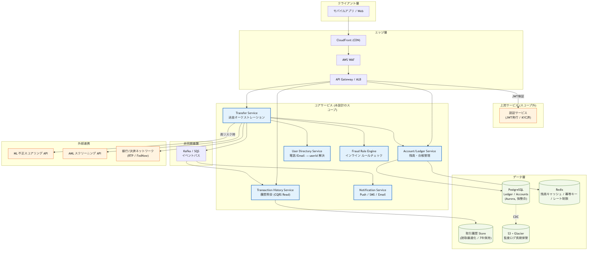
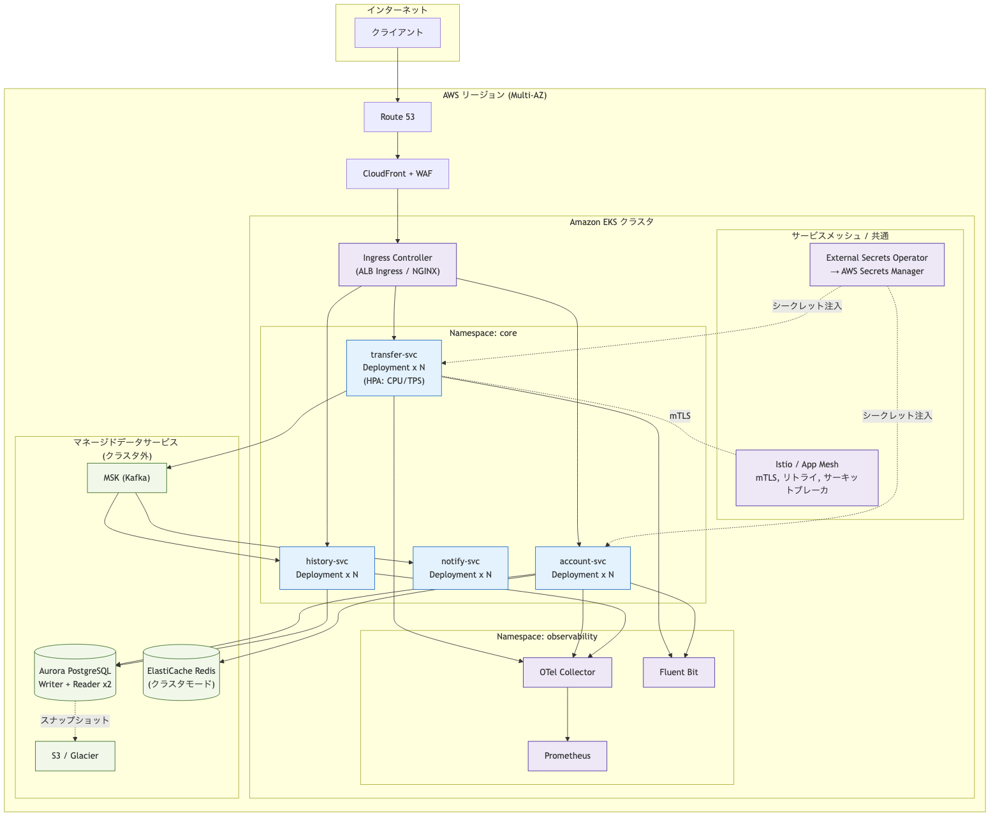
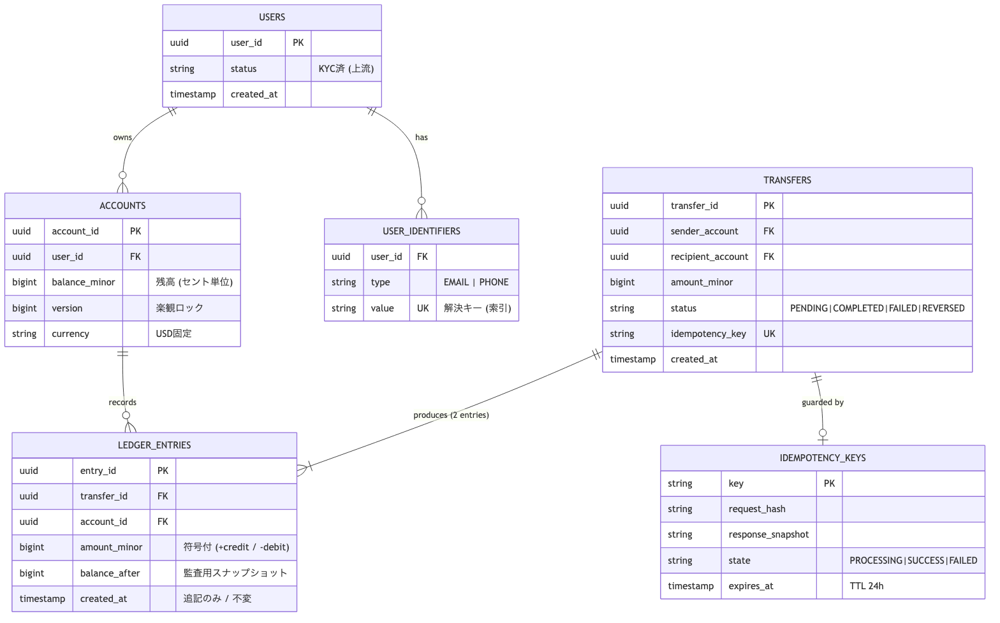
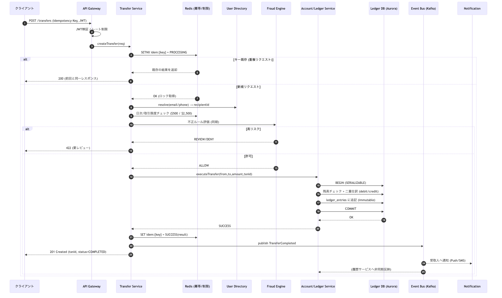

# システムデザイン面接プロンプト

## 課題（Problem Statement）

> **「P2P送金システムを設計せよ」**

---

## パート1: 確認すべき質問

### スコープ・機能要件

```
- 設計対象は Zelle や Venmo のような、電話番号やメールアドレスで識別する
  リアルタイムの銀行間送金であり、Square のようなカードベースの決済ではない、
  という理解でよいか？

- コアとなる送金機能 — 送金、受取、残高照会、取引履歴 —
  に注力し、アカウント作成や投資機能は対象外、という理解でよいか？

- 単一通貨（USD）のみのサポートを前提とし、
  多通貨対応や為替（FX）換算は含めない、という理解でよいか？

- 1回あたり$500、1日あたり$2,500 といった
  送金制限を設けるべきか？

- 受取人は銀行口座番号を直接入力するのではなく、
  電話番号またはメールアドレスで識別するべきか？

- 受取人が即座に資金を確認できる即時決済が目標であり、
  翌日処理の ACH 方式の決済ではない、という理解でよいか？
```

### 非機能要件・規模

```
- 登録ユーザー約5,000万人、DAU（デイリーアクティブユーザー）500万人
  程度のユーザー基盤を想定して設計するか？

- 平均約200 TPS、バースト時最大約1,000 TPS
  を目標とすべきか？

- 送金完了までのエンドツーエンドのレイテンシ目標は3秒か？

- 可用性99.99%（年間ダウンタイム約50分）を目標とするか？

- 規制要件を満たすため、取引履歴を7年間
  保持すべきか？

- 初期ローンチは米国のみにスコープを限定するか？
```

### セキュリティ・コンプライアンス

```
- ユーザーは登録時にKYC（本人確認）済みであり、
  認証サービスは本設計のスコープ外、という前提でよいか？

- 基本的なルールベースの不正チェックはインラインで実装し、
  ML（機械学習）ベースのスコアリングは外部サービス呼び出しとして扱うべきか？

- AML（マネーロンダリング対策）スクリーニングは内部で設計せず、
  外部APIコールとして扱ってよいか？

- カードデータを扱わないため PCI-DSS は対象外とし、
  SOC2 を主たるコンプライアンス目標としてよいか？
```

### システム・インフラ前提

```
- クラウドプロバイダーは AWS を前提とするか？

- 認証とアカウント管理は既存の上流サービスとして扱い、
  送金レイヤーに注力してよいか？

- バックエンド設計とAPIコントラクトに注力し、
  フロントエンド/モバイルはスコープ外としてよいか？

- マイクロサービスかモノリスかの選択は、
  こちらで提案・正当化してよいか？
```

---

## パート2: 面接官の想定回答

### スコープ・機能要件

```
Q: コア機能は送金・受取・残高・履歴に限定されるか？
A: その通り。アカウント作成や投資機能は対象外。

Q: 単一通貨（USD）のみか？
A: はい、当面は多通貨対応や為替換算はなし。

Q: 送金制限は1回$500、1日$2,500か？
A: はい、その通り。

Q: 受取人は電話番号またはメールで識別するか？
A: はい、銀行口座番号を直接入力する必要はない。

Q: ACH方式ではなく即時決済か？
A: はい、受取人は即座に資金が反映されるべき。
```

### 非機能要件・規模

```
Q: 登録ユーザー約5,000万人、DAU 500万人か？
A: はい、それが設計対象の規模。

Q: 平均200 TPS、ピーク1,000 TPSか？
A: その通り。

Q: エンドツーエンドのレイテンシ目標は3秒か？
A: はい、それが要件。

Q: 可用性99.99%か？
A: その通り（年間ダウンタイム約50分）。

Q: 取引履歴の7年間保持か？
A: はい、規制コンプライアンスのために必須。

Q: 初期ローンチは米国のみか？
A: はい、グローバル展開は当面スコープ外。
```

### セキュリティ・コンプライアンス

```
Q: KYCは上流で処理し、認証サービスはスコープ外か？
A: その通り、ユーザーは検証済みと想定する。

Q: ルールベースの不正チェックはインライン、MLスコアリングは外部呼び出しか？
A: はい、その分離で問題ない。

Q: AMLスクリーニングは外部APIコールか？
A: その通り、内部で設計する必要はない。

Q: PCI-DSSはスコープ外、SOC2が主たるコンプライアンス目標か？
A: はい、カードデータを扱わないため。
```

### システム・インフラ前提

```
Q: クラウドプロバイダーはAWSか？
A: はい、AWSを前提とする。

Q: 認証とアカウント管理は既存の上流サービスか？
A: その通り、送金レイヤーに注力すること。

Q: バックエンドとAPIコントラクトのみで、フロントエンドはスコープ外か？
A: はい、バックエンドに注力すること。

Q: マイクロサービス vs モノリスの選択は提案可能か？
A: はい、自分で選択して正当化すること。
```

---

## パート3: 面接官のフォローアップ深掘り

```
1. サーバが送金の途中でクラッシュしたら、どう復旧するか？

2. ネットワークリトライで同じリクエストが2回届いたら、
   二重送金をどう防ぐか？

3. 残高の読み取りと更新が並行して発生したら、
   どう整合性を担保するか？

4. 設計上のSPOF（単一障害点）はどこにあり、
   どう排除するか？

5. 取引量が10倍に増えたら、
   ボトルネックはどこで、どうスケールするか？
```

---

## パート4: 評価基準

```
✅ 要件収集
   オープンエンドな質問ではなく、具体的な前提を提案できているか？
   スコープを素早く絞り、トレードオフを確認できるか？

✅ コアとなる設計判断
   冪等性、二重支払い防止、データ整合性を
   明確に扱えているか？

✅ トレードオフの説明
   例）即時整合性 vs 可用性
       同期 vs 非同期の送金確認

✅ 段階的な設計アプローチ
   シンプルに始め、弱点を特定し、反復的に改善する。

✅ 金融ドメインへの理解
   冪等キー、補償トランザクション、不変な監査ログ。
```

---

# システムデザインドキュメント: P2P送金システム

## 1. サマリ（Executive Summary）

### 1.1 システム概要
本システムは、Zelle/Venmoライクなリアルタイムのピアツーピア（P2P）送金システムです。ユーザーは電話番号またはメールアドレスを指定するだけで、即座に他のユーザーへ送金できます。

### 1.2 機能要件
| 要件 | 内容 |
|------|------|
| コア機能 | 送金、受取、残高照会、取引履歴表示 |
| 識別方法 | 電話番号またはメールアドレス |
| 通貨 | USD単一通貨のみ |
| 送金制限 | 1回あたり$500、1日あたり$2,500 |
| 決済方式 | 即時決済（ACH方式ではない） |
| 対象外 | アカウント作成、投資機能、多通貨対応 |

### 1.3 非機能要件
| 要件 | 目標値 | 備考 |
|------|--------|------|
| ユーザー規模 | 登録ユーザー5,000万人、DAU 500万 | |
| スループット | 平均200 TPS、ピーク1,000 TPS | |
| レイテンシ | エンドツーエンドで3秒以内 | 送金完了まで |
| 可用性 | 99.99% | 年間ダウンタイム約50分 |
| データ保持 | 取引履歴を7年間保持 | 規制要件 |
| 地域 | 米国のみ（初期ローンチ） | |

### 1.4 セキュリティ・コンプライアンス
- **KYC（本人確認）**: 上流サービスで実施済み（スコープ外）
- **認証**: 既存の認証サービスを利用（スコープ外）
- **不正検知**: ルールベースの不正チェックをインライン実装、ML-basedスコアリングは外部API
- **AML（マネーロンダリング対策）**: 外部APIコール
- **コンプライアンス**: SOC2準拠（PCI-DSSは対象外）

### 1.5 技術スタック前提
- **クラウドプロバイダー**: AWS
- **アーキテクチャ**: マイクロサービスアーキテクチャ（理由は後述）
- **スコープ**: バックエンドとAPIコントラクトに集中（フロントエンド/モバイルは対象外）

### 1.6 設計方針（Design Principles）
本ドキュメントは「概要 → 設計方針 → 詳細」の順で段階的に詳細化する。金融ドメインであるため、以下を最優先の設計原則とする。

1. **正確性 (Correctness) を最優先**: お金は失っても増やしてもいけない。残高は常に整合し、二重支払いは構造的に防止する。
2. **冪等性 (Idempotency)**: ネットワークリトライによる二重送金を、Idempotency-Key で確実に防ぐ。
3. **不変な監査ログ (Immutable Audit Log)**: 台帳は追記専用（append-only）。残高は仕訳の集約結果であり、上書きしない。
4. **段階的整合性の使い分け**: 残高・台帳は**強整合（同期）**、通知・履歴反映は**結果整合（非同期）**。
5. **障害前提の設計**: あらゆるコンポーネントが落ちうる前提で、SPOFを排除しMulti-AZで冗長化する。

#### 容量見積もり（Back-of-the-envelope）
| 項目 | 計算 | 結果 |
|------|------|------|
| 平均書き込み | 200 TPS | 1送金あたり台帳2行 → 400 行/s |
| ピーク書き込み | 1,000 TPS | 2,000 行/s（バースト） |
| 読み取り（残高/履歴） | 書込の約10倍 | 〜2,000〜10,000 RPS（キャッシュ前提） |
| 取引データ量/年 | 200 TPS × 86,400 × 365 × 約1KB | 約 6.3 TB/年（7年で約 44 TB） |
| 必要な残高更新精度 | 整数（minor unit = セント） | 浮動小数点は使わない |

> **重要**: 金額はすべて `bigint`（セント等のminor unit）で保持し、丸め誤差を排除する。

---

## 2. ハイレベルアーキテクチャ（High-Level Architecture）

### 2.1 コンポーネントベースのアーキテクチャ



リクエストは `CloudFront → WAF → API Gateway/ALB` のエッジ層を通り、JWT検証後にコアサービスへルーティングされる。送金パスは **Transfer Service** がオーケストレーションを担い、残高更新は **Account/Ledger Service** が強整合トランザクションで処理する。通知・履歴反映はイベントバス経由で非同期化する。

#### マイクロサービス採用の理由（vs モノリス）
| 観点 | 判断 |
|------|------|
| **独立スケール** | 送金（書込）と履歴照会（読込）は負荷特性が大きく異なる。別々にスケールしたい |
| **障害分離** | 通知サービスの障害が送金コアに波及しないようにする |
| **コンプライアンス境界** | 台帳サービスを明確に分離し、監査・アクセス制御を集中させやすい |
| **トレードオフ** | 分散トランザクションの複雑性が増す → 後述のSaga/結果整合で対処。初期はサービス数を絞る |

> **段階的アプローチ**: 最小構成は「Transfer + Account/Ledger」の2サービス。需要に応じて History / Notification / Fraud を切り出す。過剰な分割は避ける。

#### 主要コンポーネントの責務
| コンポーネント | 責務 |
|----------------|------|
| **API Gateway / ALB** | JWT検証、レート制限、ルーティング、TLS終端 |
| **Transfer Service** | 送金フローのオーケストレーション、冪等性制御、限度額チェック、不正検知の呼び出し |
| **Account/Ledger Service** | 残高の強整合更新、二重仕訳（double-entry）台帳の追記。**唯一の残高更新主体** |
| **User Directory Service** | 電話番号/Email → `user_id` の解決（受取人特定） |
| **Transaction History Service** | CQRSの読み取り側。履歴照会に最適化。7年保持 |
| **Notification Service** | Push/SMS/Email通知（非同期、結果整合） |
| **Fraud Rule Engine** | インラインのルールベース不正チェック |
| **Event Bus (Kafka/SQS)** | サービス間の非同期連携。アウトボックスからのイベント配信 |

#### 外部連携
- **ML不正スコアリング API**: 高リスク判定時のみ同期呼び出し（タイムアウトでフォールバック）
- **AML スクリーニング API**: 制裁リスト照合
- **銀行/決済ネットワーク（RTP / FedNow）**: 即時グロス決済。本設計では「資金移動の最終ネットワーク」として外部化

### 2.2 Kubernetes（EKS）ベースのデプロイメント



AWS上で **Amazon EKS** にコアサービスをデプロイする。データストア（Aurora / ElastiCache / MSK）はマネージドサービスとしてクラスタ外に置き、運用負荷とブラスト半径を下げる。

| 項目 | 採用 | 理由 |
|------|------|------|
| **オーケストレーション** | Amazon EKS（Multi-AZ） | ノード障害・AZ障害への自動復旧 |
| **オートスケール** | HPA（CPU/カスタムメトリクスTPS）+ Cluster Autoscaler | ピーク1,000 TPSへの追従 |
| **サービスメッシュ** | Istio / App Mesh | mTLS、リトライ、サーキットブレーカ、可観測性 |
| **シークレット管理** | External Secrets Operator → Secrets Manager | DB認証情報をコードから分離 |
| **デプロイ戦略** | ローリング / カナリア（Argo Rollouts） | ゼロダウンタイム更新（99.99%目標） |
| **Pod配置** | PodAntiAffinity + topologySpreadConstraints | 同一AZ集中を防ぎSPOF排除 |

---

## 3. 共通コンポーネント（Cross-Cutting Concerns）

| 領域 | 採用技術 | 内容 |
|------|----------|------|
| **認証 / 認可** | 上流の認証サービス（JWT） + API Gatewayで検証 | KYC済前提。サービス間は **mTLS**。リソースアクセスはJWTクレーム（sub=userId）で認可 |
| **メトリクス監視** | Prometheus + Grafana / CloudWatch | TPS、レイテンシ（p50/p95/p99）、エラー率、残高更新失敗率 |
| **分散トレーシング** | OpenTelemetry + AWS X-Ray | `traceId` を全サービスに伝播。送金フローのボトルネック特定 |
| **ログ** | Fluent Bit → OpenSearch / S3 | 構造化ログ（JSON）。PII はマスキング。監査ログは別系統で改ざん防止 |
| **アラート** | Alertmanager / PagerDuty | SLO違反（可用性/レイテンシ）、残高不整合検知、不正スパイク |
| **監査ログ** | 追記専用ストア + S3 Object Lock（WORM） | 7年保持。SOC2要件。改ざん不可 |
| **設定管理** | AWS AppConfig / ConfigMap | 限度額やフラグを無停止で変更 |
| **シークレット** | AWS Secrets Manager + 自動ローテーション | DB/外部API認証情報 |
| **レート制限** | API Gateway + Redis（トークンバケット） | ユーザー単位・IP単位 |

#### 主要SLI/SLO
| SLI | SLO |
|-----|-----|
| 送金成功率 | ≥ 99.95% |
| 送金レイテンシ p99 | ≤ 3秒 |
| 可用性 | 99.99%（年間約50分） |
| 残高整合性 | 100%（日次リコンサイルで検証） |

---

## 4. アプリケーション設計概要（Application Design）

### 4.1 データモデル（エンティティ一覧）



| エンティティ | 役割 | 重要ポイント |
|--------------|------|--------------|
| **users** | ユーザー（KYC済） | 上流から同期。本サービスは参照中心 |
| **user_identifiers** | Email/電話 → userId | `value` にユニーク索引。受取人解決に使用 |
| **accounts** | 残高保持 | `balance_minor`(bigint) + `version`(楽観ロック)。残高は仕訳の集約と日次で照合 |
| **transfers** | 送金トランザクション | `status` で状態遷移管理。`idempotency_key` にユニーク制約 |
| **ledger_entries** | 二重仕訳台帳 | **追記専用・不変**。1送金につき debit/credit の2行。`balance_after` を監査用に保持 |
| **idempotency_keys** | 冪等性制御 | リクエストハッシュとレスポンスを保存。TTL付き |

#### 二重仕訳（Double-Entry Ledger）の考え方
送金 `A → B ($10)` は、必ず**合計ゼロになる2つの仕訳**として記録する。

```
ledger_entries:
  (transfer_id=T1, account=A, amount_minor=-1000, balance_after=...)  -- 出金
  (transfer_id=T1, account=B, amount_minor=+1000, balance_after=...)  -- 入金
  → Σ amount = 0 （資金の保存則）
```

残高（`accounts.balance_minor`）は性能のための**マテリアライズドビュー**であり、真実は `ledger_entries` の集約にある。これにより監査・リコンサイルが可能になる。

### 4.2 主要なエンドポイント（API契約）

| メソッド | パス | 説明 | 冪等性 |
|----------|------|------|--------|
| `POST` | `/v1/transfers` | 送金を作成・実行 | **必須**（`Idempotency-Key` ヘッダ） |
| `GET` | `/v1/transfers/{transferId}` | 送金状態の照会 | 自然に冪等 |
| `GET` | `/v1/accounts/me/balance` | 残高照会 | 自然に冪等 |
| `GET` | `/v1/transfers?cursor=&limit=` | 取引履歴（カーソルページング） | 自然に冪等 |
| `POST` | `/v1/transfers/{transferId}/reverse` | 返金/取消（補償トランザクション） | **必須** |

#### `POST /v1/transfers` リクエスト例
```http
POST /v1/transfers
Authorization: Bearer <JWT>
Idempotency-Key: 5f3c...e9   # クライアント生成のUUID

{
  "recipient": { "type": "EMAIL", "value": "bob@example.com" },
  "amount_minor": 1000,        // $10.00
  "currency": "USD",
  "note": "lunch"
}
```
#### レスポンス例
```json
{
  "transfer_id": "txn_01H...",
  "status": "COMPLETED",
  "amount_minor": 1000,
  "created_at": "2026-05-25T12:00:00Z"
}
```

### 4.3 送金フロー（シーケンス）



ポイントは以下の4点。
1. **冪等性チェックを最初に**: `SETNX idem:{key}` でロック。重複は前回レスポンスを返す。
2. **限度額・不正チェックは台帳更新の前**: 無駄な書き込みを避ける。
3. **残高更新は単一トランザクション**（`SERIALIZABLE`）: 残高確認・debit・creditを原子的に実行。
4. **通知・履歴反映は非同期**: 同期パスを短くしレイテンシ目標（3秒）を満たす。

---

## 5. セキュリティ（Security）

| 観点 | 対策 |
|------|------|
| **認証** | 上流発行のJWTを API Gateway で検証。短い有効期限 + リフレッシュ。サービス間は mTLS |
| **認可** | JWTの `sub`(userId) と操作対象アカウントの所有者一致を強制。最小権限のIAM |
| **転送中の暗号化** | 全経路 TLS 1.2+。クラスタ内も mTLS |
| **保存時の暗号化** | Aurora/Redis/S3 を KMS で暗号化。PIIフィールドはアプリ層でも暗号化検討 |
| **PII保護** | ログ・トレースで電話/Email/金額をマスキング。最小限の保持 |
| **入力検証** | スキーマ検証、金額の上限/正値チェック、SQLはパラメータ化（ORMでインジェクション防止） |
| **レート制限 / WAF** | ユーザー・IP単位のトークンバケット。WAFでL7攻撃・BOTを遮断 |
| **不正・AML** | インライン ルールチェック（速度・新規受取人・金額異常）＋ ML/AMLを外部呼び出し |
| **冪等 & リプレイ防止** | `Idempotency-Key` + リクエストハッシュ照合（同一キーで異なるbodyは拒否） |
| **監査** | 全状態変化を不変ログに記録（誰が・いつ・何を）。S3 Object Lock で WORM 化 |
| **コンプライアンス** | SOC2（PCI-DSSはカード非取扱のため対象外）。職務分掌・アクセスレビュー |
| **シークレット** | Secrets Manager + 自動ローテーション。コード/イメージに秘密を埋めない |

> **不正検知の同期/非同期の切り分け**: ルールベース（低レイテンシ）は同期でブロック。MLスコアリングは高リスク候補のみ同期、それ以外はイベント駆動で事後分析（false positiveで正常送金を止めない）。

---

## 6. 非機能要件の実現（Non-Functional / Performance）

### 6.1 レイテンシ（目標 p99 ≤ 3秒）
- **同期パスの最小化**: 通知・履歴反映・ML分析を非同期化し、クリティカルパスを「冪等チェック→限度額→ルール→台帳更新」に絞る。
- **残高キャッシュ**: 残高照会は Redis（write-through）。書込時にキャッシュを更新し、整合を保つ。
- **コネクションプーリング**: RDS Proxy / PgBouncer でDB接続を再利用し、接続枯渇とハンドシェイク遅延を回避。
- **ホットアカウント対策**: 行ロック競合を抑えるため、後述のシャーディング/バケット仕訳を検討。

### 6.2 スループット & スケーラビリティ（200→1,000 TPS、将来10x）
- **ステートレスなコアサービス** + HPA で水平スケール。状態はDB/Redis/Kafkaに外出し。
- **読み書き分離（CQRS）**: 書込は Aurora Writer、読込（履歴/残高）は Reader レプリカ＋専用History Storeへ。
- **データベース水平分割**: `accounts` / `ledger_entries` を `account_id` でシャーディング可能な設計（後述の調整事項）。
- **イベント駆動の負荷平準化**: バースト時はキューがバッファとなり、下流（通知等）を保護。

### 6.3 可用性（99.99%）
- **Multi-AZ**: EKSノード、Aurora、ElastiCache、MSK をすべて複数AZへ。
- **SPOFの排除**: 単一インスタンス依存をなくす（後述の深掘りQ4参照）。
- **グレースフルな劣化**: 通知/履歴が落ちても**送金本体は成立**する（イベントはアウトボックスに残り後で配信）。
- **サーキットブレーカ & タイムアウト**: 外部API（ML/AML/銀行）の遅延が全体を巻き込まないよう遮断＋フォールバック。

### 6.4 整合性 & 信頼性
- **強整合な台帳更新**: 残高更新は単一DBトランザクション（`SERIALIZABLE` または行ロック + 楽観バージョン）。
- **Transactional Outbox + CDC**: 「DB更新」と「イベント発行」を同一トランザクションで保証し、二重発行/取りこぼしを防ぐ（at-least-once + 冪等consumer）。
- **冪等consumer**: 通知・履歴は `transfer_id` で重複排除。

---

## 7. 調整事項（Trade-offs & Tunable Decisions）

要件次第で変更しうるポイントと、そのトレードオフを示す。「正解は一つでない」ことを明示する。

### 7.1 RDB（Aurora PostgreSQL）→ DynamoDB へ変更した場合
| 観点 | RDB（現行） | DynamoDB |
|------|-------------|----------|
| **トランザクション** | 多行ACID、`SERIALIZABLE` 容易 | `TransactWriteItems`（最大100項目）に制約。二重仕訳は工夫が必要 |
| **スケール** | 垂直＋リードレプリカ＋シャーディングで対応 | ほぼ無限の水平スケール、運用が容易 |
| **ホットパーティション** | ホット行ロック競合 | ホットパーティション分散にキー設計が重要 |
| **整合性** | 強整合が自然 | 条件付き書込（楽観ロック）で実現可。集約クエリは不向き |
| **結論** | **金融台帳の強整合・複雑クエリにRDBが第一候補** | 超大規模・単純アクセスパターンに有利。台帳には条件付き書込＋冪等で代替設計 |

> トレードオフ: DynamoDBは可用性・スケールに強い一方、二重仕訳の原子性・リコンサイル用の集約クエリで複雑性が増す。本ユースケース（強整合の台帳）ではRDBを推奨し、超大規模化時に「アカウント分割 + DynamoDB」をハイブリッド採用する選択肢を残す。

### 7.2 その他の調整ポイント
| 調整軸 | 選択肢A | 選択肢B | トレードオフ |
|--------|---------|---------|--------------|
| **送金確認** | 同期（即時COMPLETED） | 非同期（PENDING→Webhook） | 同期=UX良/可用性に敏感、非同期=高可用/UX要工夫。要件は「即時」なので同期を基本 |
| **整合性モデル** | 強整合（台帳） | 結果整合 | 残高は強整合必須。通知/履歴は結果整合で可用性を取る（CAPのトレードオフ） |
| **メッセージング** | Kafka(MSK) | SQS/SNS | Kafka=高スループット/再処理に強い、SQS=運用簡単。規模で選択 |
| **不正検知** | インラインのみ | インライン+ML | レイテンシ vs 検知精度。高リスクのみML同期で両立 |
| **マルチリージョン** | 単一リージョン（現行,US-only） | アクティブ/パッシブDR | コスト vs RTO/RPO。初期は単一+リージョンバックアップ |
| **決済ネットワーク** | クローズドループ（内部残高のみ） | RTP/FedNow連携 | 内部完結は即時・低コスト、外部連携は実銀行口座反映だが遅延/手数料 |

---

## 8. 想定問答集（Anticipated Q&A / Deep Dives）

要件 Part 3 の深掘り質問を中心に、面接で問われやすい論点と想定解答をまとめる。

### Q1. サーバが送金の途中でクラッシュしたら、どう復旧する？
**A.** 残高更新は単一DBトランザクションで原子的に行うため、COMMIT前のクラッシュは**自動ロールバック**され、部分的な引き落としは発生しない。さらに状態を `transfers.status`（PENDING→COMPLETED/FAILED）で管理し、起動時のリカバリジョブが「PENDINGのまま放置された送金」を検出して、台帳の有無に基づき完了 or 補償（reversal）で確定させる。イベント発行はTransactional Outboxでcommitと同一Txに紐づけるため、取りこぼしも防ぐ。

### Q2. ネットワークリトライで同じリクエストが2回届いたら、二重送金をどう防ぐ？
**A.** クライアントが生成する `Idempotency-Key` を必須化する。Transfer Service はまず `SETNX idem:{key}` でロックを試み、既存なら**前回と同一のレスポンス**を返す（新たな送金は行わない）。永続化層でも `transfers.idempotency_key` にユニーク制約を張り、Redis障害時の最終防衛線とする。さらにリクエストハッシュを保存し、「同一キーで異なるbody」を矛盾として拒否する。

### Q3. 残高の読み取りと更新が並行したら、整合性をどう担保する？
**A.** 二つのアプローチを併用する。(1) 残高更新は単一トランザクション内で `SELECT ... FOR UPDATE`（悲観ロック）または `version` カラムによる**楽観ロック**（CAS的更新、競合時リトライ）。(2) 残高は二重仕訳台帳の集約であり、`ledger_entries` が真実なので、`accounts.balance_minor` がズレても日次リコンサイルで検出・修正できる。残高チェックと引き落としを別Txにしない（TOCTOU回避）のが要点。

### Q4. SPOF（単一障害点）はどこにあり、どう排除する？
**A.**
- **DB**: Aurora Multi-AZ（自動フェイルオーバ）＋リードレプリカ。
- **キャッシュ**: ElastiCache クラスタモード（シャード＋レプリカ）。Redis障害時はDB直読みにフォールバック。
- **メッセージング**: MSK を複数ブローカ/AZへ。
- **コンピュート**: EKSをMulti-AZ、PodAntiAffinityでAZ分散、HPAで冗長。
- **エッジ**: CloudFront/Route53でDNSフェイルオーバ。
- **外部API**: サーキットブレーカ＋タイムアウト＋フォールバック（例: MLがダウンならルールベース判定にデグレード）。

### Q5. トランザクション量が10倍（〜10,000 TPS）になったら、ボトルネックはどこで、どうスケールする？
**A.** 最初の限界は**書き込みDB（特にホットアカウントの行ロック競合）**。対策は段階的に、
1. 読み書き分離を徹底（履歴/残高照会はレプリカ・History Storeへ逃がす）。
2. `account_id` ベースの**シャーディング**で書込を水平分割。
3. ホットアカウント（マーチャント等）は**仕訳のバケット化**（複数サブ残高に分散記帳し、合計で残高算出）でロック競合を緩和。
4. 同期処理をさらに削り、Outbox＋非同期へ。
5. 必要に応じ台帳のストレージを「アカウント分割 + DynamoDB（条件付き書込）」へ移行（7.1のトレードオフ参照）。
次のボトルネックはコネクション数 → RDS Proxyで吸収、メッセージング → パーティション増設で対応。

### Q6. なぜマイクロサービス？モノリスではダメか？
**A.** 初期は2サービス（Transfer + Account/Ledger）程度の小さく始め、負荷特性・障害分離・コンプライアンス境界の必要が出た領域（History/Notification/Fraud）から切り出す。読み（履歴）と書き（送金）でスケール特性が大きく違う点、通知障害を送金本体から隔離したい点が分割の主動機。過度な分割は分散トランザクションの複雑性を招くため避ける。

### Q7. お金の額をどう表現する？浮動小数点は？
**A.** 使わない。`bigint` の minor unit（セント）で保持し、丸め誤差・表現誤差を排除する。通貨はUSD固定（要件）だが、将来の多通貨に備え通貨コードは保持する。

### Q8. 送金の取消・返金はどう扱う？
**A.** 既存の `ledger_entries` は不変なので上書きせず、**補償トランザクション（reversal）**として逆仕訳を新たに追記する（`status=REVERSED`）。これにより監査証跡が完全に保たれる。

---
