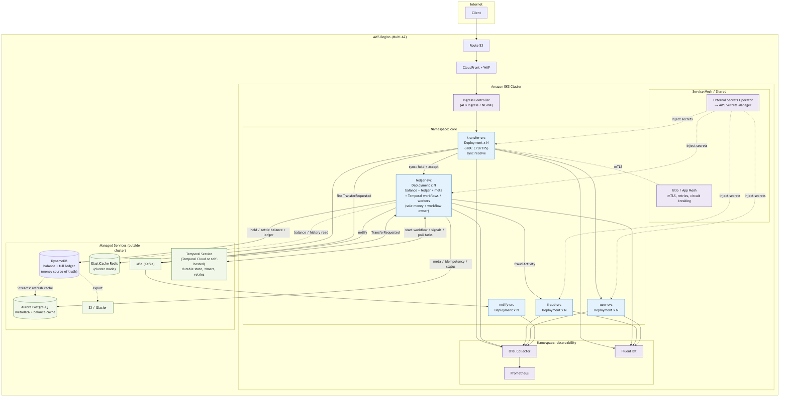

# System Design Interview Prompt

## Problem Statement

> **"Design a P2P money transfer system."**

---

## Part 1: Questions You Should Ask

### Scope & Functional Requirements

```
- Are we designing a system similar to Zelle or Venmo: real-time bank-to-bank transfers identified by phone number or email, rather than card-based payments like Square?

- Are we focusing on core transfer features — sending, receiving,
  balance checks, and transaction history —
  and excluding account creation or investment features?

- Are we assuming single-currency (USD) support only,
  without multi-currency or FX conversion?

- Should we enforce transfer limits such as
  $500 per transaction and $2,500 per day?

- Should the recipient be identified by phone number or email address,
  rather than a bank account number directly?

- Are we targeting instant settlement where the recipient sees
  the funds immediately, rather than next-day ACH-style settlement?
```

### Non-Functional Requirements & Scale

```
- Are we designing for a user base of around
  50 million registered users and 5 million DAU?

- Should we target an average of ~200 TPS
  with burst capacity up to ~1,000 TPS?

- Is a 3-second end-to-end latency the target for transfer completion?

- Are we targeting 99.99% availability (~50 minutes downtime/year)?

- Should we retain transaction history for 7 years
  to satisfy regulatory requirements?

- Are we scoping this to US-only for the initial launch?
```

### Security & Compliance

```
- Can we assume users are already KYC-verified at registration,
  and that the auth service is out of scope for this design?

- Should we include basic rule-based fraud checks inline,
  with ML-based scoring treated as an external service call?

- Can we treat AML screening as an external API call
  rather than designing it internally?

- Since we are not handling card data, can we assume
  PCI-DSS is out of scope, with SOC2 as the primary compliance target?
```

### System & Infrastructure Assumptions

```
- Are we assuming AWS as the cloud provider?

- Can we treat authentication and account management
  as existing upstream services and focus on the transfer layer?

- Should we focus on backend design and API contracts,
  and leave frontend/mobile out of scope?

- Is the choice between microservices and monolith
  open for us to propose and justify?
```

---

## Part 2: Expected Answers from Interviewer

### Scope & Functional Requirements

```
Q: Core features limited to send, receive, balance, history?
A: Correct. Account creation and investment features are out of scope.

Q: Single currency (USD) only?
A: Yes, no multi-currency or FX conversion for now.

Q: Transfer limits of $500/transaction and $2,500/day?
A: Yes, that is correct.

Q: Recipient identified by phone number or email?
A: Yes, no need to enter bank account numbers directly.

Q: Instant settlement rather than ACH-style?
A: Yes, recipient should see funds reflected immediately.
```

### Non-Functional Requirements & Scale

```
Q: ~50M registered users, 5M DAU?
A: Yes, that is the scale to design for.

Q: Average 200 TPS, peak 1,000 TPS?
A: Correct.

Q: 3-second end-to-end latency target?
A: Yes, that is the requirement.

Q: 99.99% availability?
A: Correct (~50 minutes downtime per year).

Q: 7-year transaction history retention?
A: Yes, required for regulatory compliance.

Q: US-only for initial launch?
A: Yes, global expansion is out of scope for now.
```

### Security & Compliance

```
Q: KYC handled upstream, auth service out of scope?
A: Correct, assume users are already verified.

Q: Rule-based fraud checks inline, ML scoring as external call?
A: Yes, that separation is fine.

Q: AML screening as external API call?
A: Correct, no need to design it internally.

Q: PCI-DSS out of scope, SOC2 as primary compliance target?
A: Yes, since no card data is involved.
```

### System & Infrastructure Assumptions

```
Q: AWS as cloud provider?
A: Yes, assume AWS.

Q: Auth and account management as existing upstream services?
A: Correct, focus on the transfer layer.

Q: Backend and API contracts only, frontend out of scope?
A: Yes, focus on the backend.

Q: Microservices vs. monolith open for proposal?
A: Yes, propose and justify your choice.
```

---

## Part 3: Interviewer Follow-up Deep Dives

```
1. If the server crashes mid-transfer, how do you recover?

2. If the same request arrives twice due to a network retry,
   how do you prevent a double transfer?

3. If a balance read and update happen concurrently,
   how do you ensure consistency?

4. Where are the SPOFs (Single Points of Failure) in your design,
   and how do you eliminate them?

5. If transaction volume increases 10x,
   where is the bottleneck and how do you scale?
```

---

## Part 4: Evaluation Criteria

```
✅ Requirements gathering
   Do you propose concrete assumptions rather than asking open-ended questions?
   Can you quickly narrow scope and confirm trade-offs?

✅ Core design decisions
   Can you clearly address idempotency, double-spend prevention,
   and data consistency?

✅ Trade-off articulation
   e.g. Immediate consistency vs. availability
       Synchronous vs. asynchronous transfer confirmation

✅ Incremental design approach
   Start simple, identify weaknesses, and iteratively improve.

✅ Finance domain awareness
   Idempotency keys, compensating transactions, immutable audit logs.
```

---

# System Design Document: P2P Money Transfer System

## 1. Executive Summary

### 1.1 System Overview
This system is a real-time peer-to-peer (P2P) money transfer system similar to Zelle/Venmo. Users can instantly send money to other users simply by specifying a phone number or email address.

### 1.2 Functional Requirements
| Requirement | Details |
|-------------|---------|
| Core features | Send, receive, balance check, transaction history |
| Identification | Phone number or email address |
| Currency | USD single currency only |
| Transfer limits | $500 per transaction, $2,500 per day |
| Settlement | Instant settlement (not ACH-style) |
| Out of scope | Account creation, investment features, multi-currency |

### 1.3 Non-Functional Requirements
| Requirement | Target | Notes |
|-------------|--------|-------|
| User scale | 50M registered users, 5M DAU | |
| Throughput | Average 200 TPS, peak 1,000 TPS | |
| Latency | Within 3 seconds end-to-end | Until transfer completion |
| Availability | 99.99% | ~50 minutes downtime/year |
| Data retention | Retain transaction history for 7 years | Regulatory requirement |
| Region | US only (initial launch) | |

### 1.4 Security & Compliance
- **KYC (identity verification)**: Performed by upstream service (out of scope)
- **Authentication**: Uses existing auth service (out of scope)
- **Fraud detection**: Rule-based fraud checks implemented inline; ML-based scoring as external API
- **AML (anti-money laundering)**: External API call
- **Compliance**: SOC2 compliant (PCI-DSS out of scope)

### 1.5 Technology Stack Assumptions
- **Cloud provider**: AWS
- **Architecture**: Microservices architecture (rationale below)
- **Scope**: Focus on backend and API contracts (frontend/mobile out of scope)

### 1.6 Design Principles
This document progressively elaborates in the order "overview → design principles → details." Because this is a finance domain, the following are treated as top-priority design principles.

1. **Correctness first**: Money must neither be lost nor created. Balances must always be consistent, and double-spending must be structurally prevented.
2. **Idempotency**: Reliably prevent double transfers caused by network retries using an Idempotency-Key.
3. **Immutable Audit Log**: The ledger is append-only. Balance is the aggregated result of ledger entries and is never overwritten.
4. **Tiered consistency**: Balances/ledger use **strong consistency (synchronous)**; notifications/history reflection use **eventual consistency (asynchronous)**.
5. **Failure-oriented design**: Assume every component can fail; eliminate SPOFs and add redundancy across Multi-AZ.
6. **Sync hold, async settle — money moves only at settlement**: The synchronous step does **not** move money; it places a **hold** on the sender (reserving the amount so the displayed/available balance drops immediately) and returns. The actual debit of the sender and credit of the recipient happen **only at settlement**, after the async workflow (fraud/AML → moratorium). No escrow/clearing account is used. The "instant settlement" requirement is met via a **risk-tiered moratorium** that defaults to ~0 for low-risk transfers (effectively instant) and applies a short hold only to higher-risk ones — see §4.3 and the trade-offs in §7.2.

#### Back-of-the-envelope Capacity Estimate
| Item | Calculation | Result |
|------|-------------|--------|
| Average writes | 200 TPS | 2 ledger rows per transfer → 400 rows/s |
| Peak writes | 1,000 TPS | 2,000 rows/s (burst) |
| Reads (balance/history) | ~10x writes | ~2,000–10,000 RPS |
| **Ledger rows/year** | 200 TPS × 2 rows × 86,400 × 365 | **~12.6 billion rows/year** (~88B over 7 years) |
| Transaction data volume/year | ~12.6B rows × ~1KB | ~13 TB/year (~90 TB over 7 years) |
| Required balance precision | Integer (minor unit = cents) | No floating point |

> **Important**: All monetary amounts are held as `bigint` (minor units such as cents) to eliminate rounding errors.

> **Key sizing decision — polyglot persistence, DynamoDB for money**: ~12.6B ledger rows/year is **too much for PostgreSQL**, so the entire transaction/ledger system and balances live in **DynamoDB**, which scales horizontally for this volume. PostgreSQL holds only **non-money metadata** plus a balance **display cache**:
> - **DynamoDB (source of truth for money)** — per-account **balance items** (`available` + `held`) and the full `ledger_entries` (append-only, 7-year, partitioned by `account_id`, sort key `seq`). At POST a conditional update reserves funds (`held += amount`); at settlement an atomic **`TransactWriteItems`** moves the money (sender `available -= amount, held -= amount`; recipient `available += amount`) and appends the ledger entries. Double-processing is blocked by the client's **Idempotency-Key**.
> - **PostgreSQL (metadata + cache)** — `users`, `user_identifiers`, `transfers` metadata (status, searchable memo), `transfer_events` (workflow state), `idempotency_keys`. It also keeps a **balance display cache** (`balance_cache_minor`) refreshed from **DynamoDB Streams** — *never* authoritative and *never* used for the debit decision.

---

## 2. High-Level Architecture

### 2.1 Component-Based Architecture


Requests pass through the edge layer `CloudFront → WAF → API Gateway/ALB` and, after JWT verification, reach the **Transfer Service** (synchronous front door). Transfer Service calls the **Ledger Service** to place the hold, then fires a `TransferRequested` event and returns acceptance + balance to the client. The Ledger Service is the **sole owner of money + money-metadata + the settlement workflow** (balances + ledger in DynamoDB, `transfers`/idempotency/status in PostgreSQL, and the Temporal workflow that drives the post-hold lifecycle). Ledger consumes `TransferRequested` from the event bus, starts a Temporal workflow, and runs fraud → moratorium → settlement → notify; the settlement Activity is **local to the Ledger Service** (no cross-service call back into itself).

#### Service Decomposition Principle
We do **not** split services along URL paths. Services are split along **data-ownership and dependency-direction boundaries**.

- **Ledger Service owns all money + money-metadata + the settlement workflow.** Every balance/ledger mutation and the `transfers` status row live behind one service, so the atomic writes (`TransactWriteItems`, hold) never cross a service boundary. The Temporal workflow that drives the post-hold lifecycle is **also owned by Ledger** — its Activities (settlement in particular) are local to the service, so there is no cross-service call back into the data owner.
- **Transfer Service is a thin synchronous front** — limit checks, recipient resolution, a synchronous call into Ledger to hold, and it **fires the `TransferRequested` event**. It owns no money data.
- **Fraud Engine**, **User Directory**, and **Notification** are genuinely independent concerns → separate services.

> **Why this shape.** An earlier iteration carved the workflow into a separate Workflow Service that called back into the data owner to settle. That re-introduced a cross-service round-trip on the settlement Activity (Workflow → Ledger), which is the exact kind of inter-service back-call we were trying to avoid. Folding the workflow into the Ledger Service eliminates that: the settlement Activity becomes a **local** function call within Ledger, while the dependency direction across service boundaries stays clean — `Transfer → Ledger` for the sync hold; `Transfer →(event)→ Kafka → Ledger` to start the workflow; `Ledger → Fraud`; `Ledger → Kafka → Notification`. The synchronous initiator (Transfer) is never called back by the workflow, and the data owner (Ledger) keeps all of its money operations — sync hold, async settlement — under one transactional umbrella.

#### Why This Split (vs Monolith / vs URL-based split)
| Aspect | Decision |
|--------|----------|
| **One owner of the money + workflow** | All balance/ledger/`transfers` writes and the Temporal workflow live behind **Ledger Service**, so the settlement Activity is a local call — no cross-service round-trip back into the data owner |
| **No cycle across the sync initiator** | Transfer holds and fires the event; Ledger consumes it and runs the workflow. The synchronous initiator (Transfer) is never called back, so request-time and workflow-time concerns stay decoupled |
| **Fault isolation** | Fraud / Notification failures never block the synchronous accept path (the hold), which only needs Transfer + Ledger |
| **Trade-off** | Ledger is bigger — it owns the workflow plus the data. We accept it because (a) the settlement Activity must touch the same data anyway, so keeping them together makes the Activity a local call, and (b) the cross-service split caused a back-call we did not need |

> **Incremental approach**: Split only where a real boundary exists. Here the boundaries are concrete — data ownership + workflow (Ledger), a short sync path (Transfer), and the independent Fraud / User Directory / Notification — never merely because a different URL prefix exists.

#### Responsibilities of Key Components
| Component | Responsibility |
|-----------|----------------|
| **API Gateway / ALB** | JWT verification, rate limiting, routing, TLS termination |
| **Transfer Service** | Synchronous front door: limit checks, recipient resolution, calls Ledger to hold, **fires `TransferRequested`**, returns acceptance + balance to the client. Owns no money data |
| **Ledger Service** | **Sole owner of money + money-metadata + the settlement workflow**: balances (`available`/`held`) and the ledger in DynamoDB, plus `transfers`/idempotency/`status` in PostgreSQL. Performs the hold and the settlement writes; exposes `hold`/`releaseHold` and balance reads (the synchronous API). Also **consumes `TransferRequested` from Kafka and runs the Temporal workflow** (fraud → moratorium → settlement → notify); the settlement Activity is a **local call** inside this service. The only writer of balances |
| **User Directory Service** | Resolving phone/email → `user_id` (recipient identification) |
| **Notification Service** | Push/SMS/Email notifications (asynchronous, eventually consistent) |
| **Fraud Rule Engine** | Inline rule-based fraud checks. **Owns all integrations with external risk APIs** — calls the ML fraud-scoring API and the AML screening API on behalf of the Ledger Service's fraud Activity |
| **Event Bus (Kafka/SQS)** | Asynchronous inter-service messaging — `TransferRequested`, notification fan-out, downstream consumers |

#### External Integrations
External risk APIs are **not called directly by the workflow**; they are accessed through the **Fraud Service**, which acts as the single integration point for risk/compliance. This keeps fraud/AML concerns (vendor SDKs, credentials, fallback policy, false-positive handling) out of the rest of the system.

- **ML fraud scoring API**: Called by the Fraud Service, synchronously only when judged high-risk (falls back on timeout)
- **AML screening API**: Called by the Fraud Service for sanctions-list matching
- **Bank/payment network (RTP / FedNow)**: Instant gross settlement. Externalized in this design as the "final network for moving funds"

### 2.2 Kubernetes (EKS)-Based Deployment



Core services are deployed on **Amazon EKS** on AWS. Data stores (Aurora / ElastiCache / MSK) are placed outside the cluster as managed services to reduce operational burden and blast radius.

| Item | Choice | Rationale |
|------|--------|-----------|
| **Orchestration** | Amazon EKS (Multi-AZ) | Automatic recovery from node/AZ failures |
| **Autoscaling** | HPA (CPU/custom metric TPS) + Cluster Autoscaler | Keep up with the 1,000 TPS peak |
| **Service mesh** | Istio / App Mesh | mTLS, retries, circuit breaking, observability |
| **Secret management** | External Secrets Operator → Secrets Manager | Separate DB credentials from code |
| **Deployment strategy** | Rolling / canary (Argo Rollouts) | Zero-downtime updates (99.99% target) |
| **Pod placement** | PodAntiAffinity + topologySpreadConstraints | Avoid single-AZ concentration; eliminate SPOFs |

---

## 3. Cross-Cutting Concerns

| Area | Technology | Details |
|------|-----------|---------|
| **AuthN / AuthZ** | Upstream auth service (JWT) + verification at API Gateway | Assumes KYC done. Inter-service is **mTLS**. Resource access authorized via JWT claims (sub=userId) |
| **Metrics monitoring** | Prometheus + Grafana / CloudWatch | TPS, latency (p50/p95/p99), error rate, balance-update failure rate |
| **Distributed tracing** | OpenTelemetry + AWS X-Ray | Propagate `traceId` to all services. Identify bottlenecks in the transfer flow |
| **Logging** | Fluent Bit → OpenSearch / S3 | Structured logs (JSON). PII is masked. Audit logs kept on a separate, tamper-resistant path |
| **Alerting** | Alertmanager / PagerDuty | SLO violations (availability/latency), balance-inconsistency detection, fraud spikes |
| **Audit log** | Append-only store + S3 Object Lock (WORM) | 7-year retention. SOC2 requirement. Tamper-proof |
| **Configuration management** | AWS AppConfig / ConfigMap | Change limits and flags without downtime |
| **Secrets** | AWS Secrets Manager + automatic rotation | DB/external API credentials |
| **Rate limiting** | API Gateway + Redis (token bucket) | Per-user and per-IP |

#### Key SLIs/SLOs
| SLI | SLO |
|-----|-----|
| Transfer success rate | ≥ 99.95% |
| Transfer latency p99 | ≤ 3 seconds |
| Availability | 99.99% (~50 minutes/year) |
| Balance consistency | 100% (verified by daily reconciliation) |

---

## 4. Application Design

### 4.1 Data Model (Entity List)


| Entity | Store | Role | Key Points |
|--------|-------|------|------------|
| **balance** | **DynamoDB** | Authoritative balance | Per-account item: `available_minor` (real balance) + `held_minor` (reserved by in-flight transfers) + **`version`** (optimistic lock) + `updated_at`. **Spendable = available − held.** POST reserves (`held +=`); settlement moves (`available -=`/`+=`). **Every write carries `ConditionExpression: version = expected` and sets `version+1`** — this serializes concurrent updates to the same account (incl. two settlements crediting the same recipient) |
| **ledger** | **DynamoDB** | Full double-entry ledger | All entries, append-only, 7-year. Partition key `account_id`, sort key `seq`; GSI on `transfer_id`. **Appended only at settlement** (type `DEBIT`/`CREDIT`/`REVERSAL`), carrying `amount_minor`, `balance_after`, and `balance_version` (the balance item version it committed against). ~12.6B rows/yr. Source of truth for **history/audit** |
| **users** | PostgreSQL | Users (KYC done) | Synced from upstream. Reference-centric metadata |
| **user_identifiers** | PostgreSQL | Email/phone → userId | Unique index on `value`. Used for recipient resolution |
| **accounts (meta)** | PostgreSQL | Account metadata + balance **cache** | currency, etc. `balance_cache_minor` is a **display cache only** (refreshed from DynamoDB Streams), never authoritative, never used for the debit decision |
| **transfers (meta)** | PostgreSQL | Transfer metadata / search / workflow | Lifecycle `status` (`DEBITED → FRAUD_REVIEW → MORATORIUM → SETTLED`, or `CANCELLED`/`REVERSED`), searchable `note`, `settle_after`. Unique constraint on `idempotency_key`. **Money amounts live in DynamoDB, not here** |
| **transfer_events** | PostgreSQL | Audit / read-side projection | A queryable record of each step (`FRAUD`/`MORATORIUM`/`SETTLE`/`NOTIFY`). The **authoritative** workflow state lives in Temporal's event history; this table is a projection for app queries, dashboards, and audit |
| **idempotency_keys** | PostgreSQL | Idempotency control | Request hash + response. (The DynamoDB transaction also carries its own idempotency guard item — see below.) |

#### Hold-then-settle (no escrow)
The recipient credit is **deferred** until after fraud/AML + moratorium. We do **not** move money to an escrow account in between. Instead, the synchronous step only **reserves** the amount on the sender via a `held` counter; the real debit and credit happen together **only at settlement**. The displayed/available balance drops immediately (because available − held shrinks), but no funds have actually moved until settlement.

```
At POST (SYNC):   reserve on sender   [one conditional UpdateItem — no ledger entry, no escrow]
  UpdateItem sender balance: held += amount, version += 1
    condition: available - held >= amount AND version = Vs   ← insufficient funds → HTTP 422; stale → retry
  (available is unchanged — real money has NOT moved)

At SETTLEMENT (ASYNC, after moratorium):  move the money   [one TransactWriteItems]
  read sender (version=Vs) and recipient (version=Vr) balance items first
  - sender    : available -= amount, held -= amount, version = Vs+1   condition: version = Vs
                + append DEBIT ledger entry (balance_after, balance_version=Vs+1)
  - recipient : available += amount,                 version = Vr+1   condition: version = Vr
                + append CREDIT ledger entry (balance_after, balance_version=Vr+1)
    + condition: idempotency_key not already settled     ← exactly-once settlement
  → if EITHER item changed concurrently, the whole TransactWriteItems fails
    (TransactionCanceledException) → re-read versions and retry. No lost update.
  → the DEBIT and CREDIT sum to zero (conservation of funds)

Cancellation (during moratorium / on DENY):  just release the hold
  UpdateItem sender balance: held -= amount, version += 1   condition: version = Vs
  (no ledger entry — money never moved)
```

**Where is the truth?** **Money lives in DynamoDB.** The authoritative balance is the per-account balance item (`available`, `held`, `version`); **spendable = available − held**. The double-spend check is the conditional `available - held >= amount` on the POST hold — done atomically against DynamoDB, never the cache. Every balance mutation also carries `ConditionExpression: version = expected` and bumps `version`, so **concurrent updates to the same account are serialized** — including the case that motivated this (two settlements crediting, or a debit and a credit hitting, the **same** account at once): the second write sees a changed `version`, fails, and retries against the fresh value, so no update is lost. Ledger entries are written **only at settlement** (when money truly moves) and carry `balance_after` + `balance_version` for audit. **PostgreSQL holds no authoritative money** — its `balance_cache_minor` is a display cache refreshed asynchronously from DynamoDB Streams and is never read for the debit decision. This is a deliberate **polyglot-persistence** split: DynamoDB for the high-volume balance + ledger; PostgreSQL for rich relational metadata, search, and workflow state.

### 4.2 Key Endpoints (API Contract)

| Method | Path | Description | Idempotency |
|--------|------|-------------|-------------|
| `POST` | `/v1/transfers` | Create and execute a transfer | **Required** (`Idempotency-Key` header) |
| `GET` | `/v1/transfers/{transferId}` | Query transfer status | Naturally idempotent |
| `GET` | `/v1/accounts/me/balance` | Balance inquiry | Naturally idempotent |
| `GET` | `/v1/transfers?cursor=&limit=` | Transaction history (cursor paging) | Naturally idempotent |
| `POST` | `/v1/transfers/{transferId}/cancel` | Cancel during the moratorium window (before SETTLED) — appends a reversal | **Required** |
| `POST` | `/v1/transfers/{transferId}/reverse` | Post-settlement refund (compensating transaction) | **Required** |

#### Example `POST /v1/transfers` Request
```http
POST /v1/transfers
Authorization: Bearer <JWT>
Idempotency-Key: 5f3c...e9   # client-generated UUID

{
  "recipient": { "type": "EMAIL", "value": "bob@example.com" },
  "amount_minor": 1000,        // $10.00
  "currency": "USD",
  "note": "lunch"
}
```
#### Example Response
The synchronous response returns immediately after the sender's funds are **held** (reserved); no money has moved yet. The actual debit/credit happen at settlement.
```json
{
  "transfer_id": "txn_01H...",
  "status": "DEBITED",
  "amount_minor": 1000,
  "settle_after": "2026-05-25T12:01:00Z",
  "created_at": "2026-05-25T12:00:00Z"
}
```

### 4.3 Transfer Flow (Sequence)


The flow is deliberately split into a **short synchronous path** (so `POST /v1/transfers` returns fast) and an **asynchronous settlement workflow**.

The flow is deliberately split into a **short synchronous path** (`Transfer → Ledger`, so `POST /v1/transfers` returns fast) and an **asynchronous settlement workflow** owned and run by the **Ledger Service** on Temporal.

**Synchronous (`POST /v1/transfers` → 200 OK):**
1. **Transfer Service**: limit check (e.g. $500/txn, $2,500/day) and recipient resolution — cheap to reject early — then a synchronous call into Ledger Service to hold.
2. **Ledger Service — metadata + idempotency**: write the `transfers` row to PostgreSQL (unique constraint on `idempotency_key`); a duplicate conflicts and the stored response is returned.
3. **Ledger Service — hold only (DynamoDB)**: one conditional `UpdateItem` sets `held += amount` with condition `available - held >= amount`. `ConditionalCheckFailed` → insufficient funds, 422. No ledger entry, no money moved yet. Ledger returns acceptance + new balance to Transfer Service.
4. **Transfer Service fires `TransferRequested`** (only after Ledger accepted) and returns `200 OK (status=DEBITED, balance)` to the client.

**Asynchronous settlement — Ledger Service runs the Temporal workflow.** Ledger consumes `TransferRequested` and starts a **Temporal workflow**. Temporal persists its state, timers, and retries, so there is no hand-rolled state machine or in-process timer. Steps run as **Activities** (auto-retried with timeouts); the moratorium is a **durable timer**; cancellation is a **Signal**. The settlement and hold-release Activities are **local to the Ledger Service** — they read/write the same DynamoDB and PostgreSQL data the synchronous API does, but as in-process function calls rather than cross-service round-trips.
1. **Fraud / AML check (Activity)**: Suspicious-merchant and AML screening (via Fraud Service). A small fraction may require a **human approval flow**. On deny → call Ledger to **release the hold** (`held -= amount`, no ledger entry — money never moved) and set `transfers.status=CANCELLED`.
2. **Moratorium (durable timer)**: `workflow.Sleep` until `settle_after` so the user can still cancel. A **cancel Signal** interrupts the timer and releases the hold. Temporal owns the timer — no in-process sleep, no external poller; the workflow resumes when it fires, even across worker restarts.
3. **Settlement Activity → Ledger Service (money actually moves now)**: Ledger runs one `TransactWriteItems` that debits the sender (`available -= amount, held -= amount`, append DEBIT) and credits the recipient (`available += amount`, append CREDIT), each balance update conditioned on its `version` and the Idempotency-Key not yet settled; sets `transfers.status=SETTLED`.
4. **Notification (Activity)**: Publish `TransferSettled`; notify both the sender and the recipient (Push/SMS/Email).

> **Why this split?** The synchronous hold gives the sender immediate feedback and reserves the funds (the conditional `available - held >= amount` write prevents double-spend) **without moving money**, while deferring the actual transfer lets us run fraud/AML and offer a cancellation window. Because no money has moved until settlement, a cancellation is just releasing a hold — there is nothing to claw back. Routing the workflow through an **event** (Transfer fires `TransferRequested`, Ledger consumes it) decouples the sync path from the long-running workflow without a cross-service back-call. **Temporal** makes the workflow durable and resumable after a crash, with the moratorium as a first-class durable timer.

---

## 5. Security

| Aspect | Measure |
|--------|---------|
| **Authentication** | Verify upstream-issued JWT at the API Gateway. Short expiry + refresh. Inter-service is mTLS |
| **Authorization** | Enforce that the JWT `sub`(userId) matches the owner of the target account. Least-privilege IAM |
| **Encryption in transit** | TLS 1.2+ on all paths. mTLS within the cluster too |
| **Encryption at rest** | Aurora/Redis/S3 encrypted with KMS. Consider app-layer encryption for PII fields as well |
| **PII protection** | Mask phone/email/amount in logs and traces. Minimal retention |
| **Input validation** | Schema validation, amount upper-bound/positive-value checks, parameterized SQL (ORM to prevent injection) |
| **Rate limiting / WAF** | Per-user and per-IP token bucket. WAF blocks L7 attacks and bots |
| **Fraud / AML** | The Fraud Service performs inline rule checks (velocity, new recipient, anomalous amount) and is the sole caller of the external ML/AML APIs; only the Ledger Service's fraud Activity calls the Fraud Service |
| **Idempotency & replay prevention** | `Idempotency-Key` + request-hash matching (reject same key with a different body) |
| **Audit** | Record all state changes in an immutable log (who, when, what). WORM via S3 Object Lock |
| **Compliance** | SOC2 (PCI-DSS out of scope since no card data). Separation of duties, access reviews |
| **Secrets** | Secrets Manager + automatic rotation. Never embed secrets in code/images |

> **Synchronous/asynchronous split of fraud detection**: Rule-based (low latency) blocks synchronously. ML scoring is synchronous only for high-risk candidates; otherwise it is event-driven for post-hoc analysis (do not stop legitimate transfers on false positives).

---

## 6. Realizing Non-Functional Requirements (Performance)

### 6.1 Latency (Target p99 ≤ 3 seconds)
- **Minimize the synchronous path**: The synchronous request only does "idempotency check → limit check → recipient resolution → **hold funds** → return 200." Fraud/AML, the moratorium, settlement, and notifications are all moved to the async workflow, keeping the user-facing latency well under 3 seconds.
- **Balance reads**: The authoritative balance is the DynamoDB balance item (`available`, `held`); **spendable = available − held**, a single fast key read. The PostgreSQL `balance_cache_minor` may back UI display, but the **hold/settle decision always reads/conditions on DynamoDB**, never the cache.
- **Connection pooling**: Reuse PostgreSQL connections with RDS Proxy / PgBouncer; DynamoDB is accessed over HTTP with the SDK's connection reuse.
- **Hot-account note**: Because each account's writes chain through `seq`, a single very hot account (e.g. a popular merchant) serializes its own writes. That is correct (its true running balance is inherently sequential); to scale such an account, see the sub-account option in §7.2.

### 6.2 Throughput & Scalability (200→1,000 TPS, future 10x)
- **Stateless core services** + HPA for horizontal scaling. State is externalized to DB/Redis/Kafka.
- **Polyglot storage**: All money (the ledger, which carries balance) is in **DynamoDB**, which scales horizontally for the ~12.6B rows/yr write/read volume; balance and history reads go there. PostgreSQL handles only bounded metadata/search/workflow, so the relational tier never carries the huge stream.
- **Native partitioning**: DynamoDB partitions the ledger by `account_id` (sort key `seq`), spreading load across accounts; PostgreSQL metadata is small and can be partitioned/sharded by `account_id` if ever needed (see Tunable Decisions below).
- **Event-driven load leveling**: During bursts, the queue acts as a buffer, protecting downstream (e.g., notifications).

### 6.3 Availability (99.99%)
- **Multi-AZ**: EKS nodes, Aurora, ElastiCache, MSK, and the Temporal service all span multiple AZs (Temporal Cloud or a self-hosted multi-AZ cluster).
- **Eliminate SPOFs**: Remove dependence on single instances (see deep-dive Q4 below).
- **Graceful degradation**: Even if notifications/history go down, **the transfer itself still succeeds** (events remain in the outbox and are delivered later).
- **Circuit breakers & timeouts**: Cut off + fall back so that latency in external APIs (ML/AML/bank) does not drag down the whole system.

### 6.4 Consistency & Reliability
- **Atomic money movement + optimistic locking**: Every balance write carries `ConditionExpression: version = expected` and bumps `version`. The POST hold also checks `available - held >= amount` (overspend prevention). Settlement is one **`TransactWriteItems`** that updates both the sender (version `Vs→Vs+1`) and recipient (version `Vr→Vr+1`) balance items, each conditioned on its own version, plus the two ledger entries, plus the Idempotency-Key not-settled guard. If **either** account was modified concurrently, the whole transaction fails (`TransactionCanceledException`) and is retried against fresh versions — no lost update even when two transfers touch the same account at the same time. All-or-nothing, exactly once.
- **Cache is asynchronous, never authoritative**: The PostgreSQL `balance_cache_minor` is refreshed from **DynamoDB Streams** (eventually consistent). It is display-only; staleness can never cause a wrong debit because debits read/condition on the DynamoDB ledger.
- **Cross-store metadata**: The `transfers` metadata write (PostgreSQL) and the money write (DynamoDB) are two stores; we write the metadata row (with the idempotency key) first, then the conditional DynamoDB transaction. A crash between them is reconciled by the workflow (a `DEBITED` metadata row with no matching ledger entry is retried or rolled back).
- **Idempotent everywhere**: The Idempotency-Key condition in the DynamoDB transaction and the Kafka consumers' dedupe by `transfer_id` make retries safe.
- **Continuous reconciliation**: A job replays an account's settled ledger entries and checks the chain (prev + amount = next = `available`), and that each account's `held` equals the sum of its in-flight (DEBITED/FRAUD_REVIEW/MORATORIUM) transfers; divergence raises an alert.

---

## 7. Trade-offs & Tunable Decisions

This section presents points that can change depending on requirements, along with their trade-offs, making it clear that "there is no single right answer."

### 7.1 Polyglot Persistence: DynamoDB for money, PostgreSQL for metadata
The volume (~12.6B ledger rows/year) rules out PostgreSQL for the ledger, so money (the ledger, which carries the balance) lives in **DynamoDB**, and PostgreSQL keeps only metadata + a display cache:

| Aspect | DynamoDB (money: ledger + balance) | PostgreSQL (metadata + cache) |
|--------|------------------------------------|-------------------------------|
| **Holds** | Balance items (`available`/`held`) + full ledger (7-year, append-only) | users, transfers meta, workflow events, **balance display cache** |
| **Transactions** | `TransactWriteItems` (up to 25 items) — atomic balanced entries + conditions | Multi-row ACID for metadata (not money) |
| **Scaling** | Near-unlimited horizontal scale, partitioned by `account_id` | Bounded, small relational data; easy to operate |
| **Consistency** | Strongly-consistent conditional writes (hold check, settlement) | The cache is eventually consistent (DynamoDB Streams); never authoritative |
| **Why** | Massive write throughput + cheap long-term retention for the ledger | Rich queries: search by memo, joins, workflow state, reporting |

> Trade-off: putting money in DynamoDB means **overspend prevention and ordering must be expressed as conditional appends** (optimistic lock on the next `seq`) rather than SQL `SERIALIZABLE`, and per-account writes are serialized by the `seq` chain. We accept this because the ledger volume is infeasible for PostgreSQL, and the conditional `TransactWriteItems` gives both scale (across accounts) and correctness (within an account). The metadata/cache in PostgreSQL is eventually consistent with DynamoDB (via Streams), reconciled by a continuous job. **Alternatives**: (a) all-PostgreSQL with partitioning + S3 archival — simplest consistency story but the row volume is operationally infeasible; (b) money in PostgreSQL, history in DynamoDB (an earlier iteration) — keeps SQL ACID for balances but still needs cross-store sync and caps write scale at the relational Writer. Putting the whole ledger in DynamoDB is the choice when ledger scale dominates.

### 7.2 Other Tunable Points
| Tunable axis | Option A | Option B | Trade-off |
|--------------|----------|----------|-----------|
| **Transfer confirmation** | Fully synchronous (immediate COMPLETED) | **Sync hold + async settle** (chosen) | Fully sync gives the simplest UX but leaves no room for fraud review / cancellation. We chose sync-hold + async settlement: the sender's available balance drops immediately (funds reserved, no money moved), while fraud/AML and a moratorium run off the critical path; money actually moves at settlement. Trade-off: the recipient sees funds after settlement, not instantly — acceptable given the moratorium/fraud requirements |
| **Moratorium length** | 0 (settle immediately) | Minutes–hours | Longer window = more cancellation/fraud safety but slower perceived delivery. Tunable per risk tier (e.g. new recipient, large amount) via `settle_after` |
| **Consistency model** | Strong consistency (balance/ledger in DynamoDB) | Eventual consistency (PG balance cache, notifications) | Money uses strongly-consistent conditional writes in DynamoDB. The PostgreSQL display cache and notifications are eventually consistent for availability (CAP trade-off) |
| **Very hot account** | Single ledger per account (chosen) | Split into N **sub-accounts** | Because per-account writes serialize on the `seq` chain, an extremely hot account (a giant merchant) could become a write hotspot. If needed, model it as N sub-accounts (each its own ledger partition) and sum/route across them — adds routing + aggregation complexity, so apply only to the rare hotspot, not by default |
| **Messaging** | Kafka (MSK) | SQS/SNS | Kafka = high throughput / strong reprocessing; SQS = simpler ops. Choose by scale |
| **Fraud detection** | Inline only | Inline + ML | Latency vs detection accuracy. Use sync ML only for high-risk to balance both |
| **Multi-region** | Single region (current, US-only) | Active/passive DR | Cost vs RTO/RPO. Initially single region + regional backups |
| **Payment network** | Closed loop (internal balance only) | RTP/FedNow integration | Internal-only is instant/low-cost; external integration reflects to real bank accounts but adds latency/fees |

---

## 8. Anticipated Q&A / Deep Dives

Centered on the deep-dive questions in Part 3, this section lists points likely to be asked in an interview along with model answers.

### Q1. If the server crashes mid-transfer, how do you recover?
**A.** No money moves until settlement, which is a single **DynamoDB `TransactWriteItems`** (all-or-nothing) — a crash before it commits leaves no partial debit/credit. The synchronous step only places a `held` reservation; a crash there leaves at most an orphaned hold, which is harmless and swept by a reconciliation job that matches holds to in-flight `transfers` (it also **re-emits `TransferRequested`** if Transfer Service got the hold accepted but crashed before publishing — the event is sent at-least-once and the workflow start is idempotent on `transfer_id`). The settlement lifecycle runs as a **Temporal workflow**, so its state, the moratorium timer, and per-Activity retries are **persisted by Temporal**, not held in process memory. A worker crash mid-workflow is transparent: Temporal replays the workflow's event history on another worker and resumes exactly where it left off (the durable timer keeps counting even while no worker is alive). Each Activity is idempotent — settlement is conditioned on the Idempotency-Key not yet settled — so a retried Activity is a no-op rather than a double-apply. Temporal gives us this durable execution out of the box, which is precisely why we use it instead of a hand-rolled scheduler.

### Q2. If the same request arrives twice due to a network retry, how do you prevent a double transfer?
**A.** Require a client-generated `Idempotency-Key`. Two layers: (1) the PostgreSQL `transfers` metadata row has a **unique constraint** on `idempotency_key`, so a duplicate create conflicts and returns the prior response; (2) more importantly, the money mutation's **`TransactWriteItems` includes a guard item** keyed by `transfer_id`/phase with an `attribute_not_exists` condition — so even if the same transaction is retried, the conditional write fails (`ConditionalCheckFailed`) and the balance is debited exactly once. Idempotency thus protects the money write atomically inside DynamoDB, not just at the metadata layer. The stored request hash also lets us reject "the same key with a different body" as a conflict.

### Q3. If a balance read and update happen concurrently, how do you ensure consistency?
**A.** The balance is a DynamoDB item (`available`, `held`, `version`) mutated only by conditional writes, and **`version` is an explicit optimistic lock**: every write reads the current `version=V`, conditions on `version = V`, and sets `version = V+1`. So if two operations touch the **same account** concurrently — e.g. two settlements both crediting the same popular recipient, or a debit and a credit racing — only the first commits; the second sees `version` already advanced, gets `ConditionalCheckFailed` (or `TransactionCanceledException` for the settlement `TransactWriteItems`), re-reads, and retries. This closes the lost-update window that a plain `available += amount` would have. The POST hold additionally checks `available - held >= amount` (atomic check-and-write, no TOCTOU, no overspend). The decision is **never** made against the PostgreSQL cache. A reconciliation job confirms each account's `held` equals the sum of its in-flight transfers and that the settled ledger chains to `available`.

### Q4. Where are the SPOFs (single points of failure), and how do you eliminate them?
**A.**
- **Money store**: DynamoDB is multi-AZ and regionally replicated by design (no single node to lose); the authoritative balance/ledger has no single point of failure.
- **Metadata DB**: Aurora Multi-AZ (automatic failover) + read replicas.
- **Cache**: ElastiCache cluster mode (shards + replicas); also, the PostgreSQL balance cache is non-authoritative, so its staleness/failure never blocks a debit (which reads DynamoDB).
- **Messaging**: MSK across multiple brokers/AZs.
- **Compute**: EKS Multi-AZ, AZ distribution via PodAntiAffinity, redundancy via HPA.
- **Edge**: DNS failover via CloudFront/Route 53.
- **External APIs**: Circuit breaker + timeout + fallback (e.g., if ML is down, degrade to rule-based judgment).

### Q5. If transaction volume increases 10x (~10,000 TPS), where is the bottleneck and how do you scale?
**A.** The ledger is in **DynamoDB**, partitioned by `account_id`, so aggregate throughput scales horizontally near-linearly — the money store is not the first wall. The pressure points and countermeasures, incrementally:
1. **A single very hot account** is the main risk — its writes serialize on the per-account `seq` chain (correct, but a hotspot). If one account dominates, model it as N **sub-accounts** (each its own ledger partition) and route/aggregate across them (see §7.2). Most accounts never need this.
2. Keep the synchronous path minimal (one conditional hold `UpdateItem`); push fraud/moratorium/settlement/notify to the async workflow.
3. Use **DynamoDB on-demand or auto-scaling** so capacity tracks the write stream; the `account_id` partition key spreads load and avoids hot partitions in aggregate.
4. The **PostgreSQL metadata** tier is bounded and small relative to the ledger; scale it with read replicas, and partition by `account_id` only if needed. The balance cache is refreshed by DynamoDB Streams consumers.
5. Messaging scales by adding Kafka partitions; the workflow scales by adding **Temporal workers** (stateless — they poll task queues, with Temporal holding the durable state).
The next bottleneck, connection count to PostgreSQL, is absorbed by RDS Proxy.

### Q6. How did you decide service boundaries? Why not split by URL path, and why not a full monolith?
**A.** Boundaries follow **data ownership and dependency direction, not URL paths**. All money writes (balances + ledger in DynamoDB, `transfers`/status in PostgreSQL) sit behind one **Ledger Service**, so the atomic writes never cross a service boundary — no distributed transaction. The **Transfer Service** is a thin synchronous front (limit check, resolve, call Ledger to hold). The long-running Temporal workflow is **owned by the Ledger Service itself**: an earlier iteration carved out a separate Workflow Service, but that introduced a cross-service back-call (Workflow → Ledger) on the settlement Activity, which touches the same data Ledger already owns — keeping the workflow inside Ledger turns that into a local function call. The sync initiator (Transfer) is never re-entered: it fires a `TransferRequested` event after the hold, and Ledger consumes it on the workflow side. Direction across services: `Transfer → Ledger`, `Transfer →(event)→ Kafka → Ledger`, `Ledger → Fraud`, `Ledger → Kafka → Notification`. **Fraud**, **User Directory**, and **Notification** stay independent (separate data, failure modes, scaling). It is neither a monolith nor an over-decomposed mesh — each boundary maps to a real concern.

### Q7. How do you represent monetary amounts? What about floating point?
**A.** Do not use it. Hold amounts as `bigint` minor units (cents) to eliminate rounding and representation errors. The currency is fixed to USD (per requirements), but a currency code is retained to prepare for future multi-currency.

### Q8. How do you handle cancellation and reversals/refunds?
**A.** Two cases, both append-only (existing `ledger_entries` are never mutated):
- **Cancellation during the moratorium** (before `SETTLED`): no money has moved — just **release the hold** (`held -= amount`) and set `status=CANCELLED`. No ledger entry, nothing to claw back.
- **Post-settlement refund**: money has moved, so append a compensating **`REVERSAL`** `TransactWriteItems` (recipient `available -= amount` + DEBIT entry, sender `available += amount` + CREDIT entry) and set `status=REVERSED`.

In both cases the immutable ledger preserves a complete audit trail, and `transfer_events` records who/what triggered the change.

---

